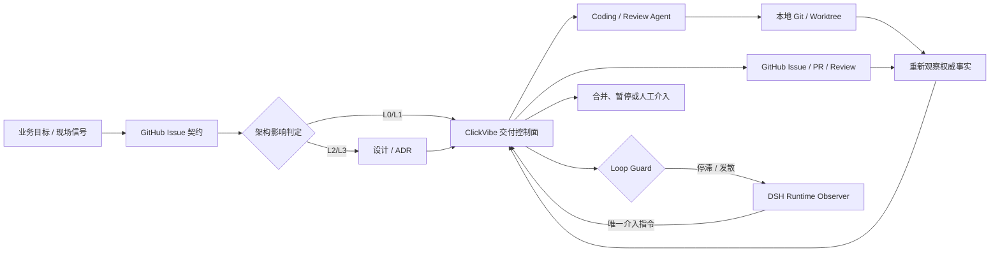
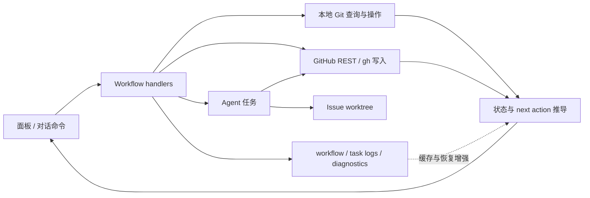

# ClickVibe 当前有效架构

> Status: Accepted | Owner: ClickVibe maintainers | Last updated: 2026-08-26 | Scope: v0.2 architecture baseline; v0.1 differences are called out explicitly

本文是 ClickVibe 架构的唯一入口。它回答“当前系统由什么组成、事实由谁拥有、变化如何进入系统”。详细设计放在 `docs/architecture/`，重要取舍放在 `docs/architecture/decisions/`；带日期的 `docs/plans/` 只记录一次实施过程，不自动成为当前架构。

## 产品边界

ClickVibe 是一个 **local-first、GitHub-native、BYO-agent 的 Issue-to-Merge 交付控制面**。它不替代 Coding Agent，也不判断业务需求是否正确；它把已定义的 GitHub Issue 交付契约变成可隔离、可恢复、可审查、可自动推进的工程闭环。v0.2 仍以 GitHub 为首个完整适配器，但核心 Work Item 身份采用 provider/instance/container/id 四元组，避免把 GitHub 数字 Issue 编号固化为永久领域模型。

业务 Issue 负责描述变化；架构负责约束变化怎样进入系统；PR 负责证明变化既满足验收标准，也没有破坏系统契约。

## 当前 v0.1 与 v0.2 目标

| 维度 | v0.1 现状 | v0.2 架构基线 |
|---|---|---|
| 产品闭环 | 基本可工作的实验性单 Issue 流水线 | 可恢复、证据驱动的 Issue-to-Merge 控制面 |
| 设计入口 | 产品、状态、计划文档分散 | 本文为唯一入口，ADR 记录决策替代关系 |
| 核心数据 | `IssueWorkflow` 聚合身份、任务、Review、自动运行和事件 | Canonical Domain Model 统一身份、Basis、Evidence、Decision、Run、Review 与 Event 契约 |
| Issue 到 coding | 目标/验收/依赖可直接进入开发 | 先做架构影响分级；L2/L3 先设计后开发 |
| 自动化 | 可自动开发/review/返工；merge 可配置 | 策略允许时自动推进与合并；异常和高风险才升级给人 |
| Agent 权限 | 能调用 git/gh，但边界主要靠提示词和流程 | Agent 拥有完成工作所需工具；控制器、门禁和 GitHub 规则决定结果是否生效 |
| 循环收敛 | 协议 Observer 仅有 Skill；运行时主要依赖总轮次上限 | 纯规则 Loop Guard 识别停滞/发散，DSH Runtime Observer 在人工介入前给出一次受约束的修法重定向 |
| 可观测性 | 日志、事件、diagnostics 已有但入口分散 | 统一事件信封、因果链、原始错误和可复盘快照 |

### v0.1 已实现的数据流

v0.1 已验证部分事实推导、Agent 流程和持久化能力，但它没有保留特权。v0.2 以目标不变量为准，逐项决定复用、重构、迁移、归档或废弃；妨碍单一事实源和长期边界的实现可以直接替换，重写本身也不能免除测试、证据、数据处置和回滚责任。并行流水线首先受 GitHub/gh 与本地 Git 请求争用约束，因此请求枚举、统一入口、缓存/去重、写后失效和关键门禁刷新是 v0.2 的 P0。

## 系统视图

- [产品演进路线](roadmap.md)：v0.2.0 至 v0.10.0 的主矛盾、顺序与退出标准。
- [系统上下文](architecture/system-context.md)：DSH、ClickVibe、Agent、Git 与 GitHub 的责任边界。
- [Canonical Domain Model](architecture/canonical-domain-model.md)：v0.2 全部 Domain、关系、生命周期、事实所有者与稳定等级。
- [核心数据契约](architecture/core-contracts.md)：跨平台身份、DeliveryBasis、Run、Review、Decision、Event 和 v0.1 迁移语义。
- [核心数据流](architecture/core-data-flow.md)：从 Issue 到合并/暂停的数据流，以及读缓存和写后回读。
- [事实源与状态权威](architecture/authority-model.md)：哪些事实可以决定动作，哪些只是缓存或证据增强。
- [交付状态机](architecture/workflow-state-machine.md)：Observe → Decide → Apply → Re-observe 的收敛循环。
- [自动化与信任](architecture/automation-and-trust.md)：Agent 权限、冲突解决、自动合并和人工介入条件。
- [循环监督与 Observer](architecture/observer-intervention.md)：Loop Guard、DSH Runtime Observer、协议演化和人工升级边界。
- [可观测性与复盘](architecture/observability.md)：日志、事件、错误、证据与架构版本绑定。
- [架构决策记录](architecture/decisions/README.md)：Accepted、Superseded 和 Draft 决策。

## 代码结构

宿主入口 `src/index.ts` 只负责插件注册、HTTP 路由入口和方法分发；业务实现按单向依赖组织：

1. `src/infra`：配置、持久化、git/shell、HTTP、进程与流编解码等基础适配器。
2. `src/github`：GitHub REST 读取、映射和写入适配器，只依赖 infra。
3. `src/agent`：Agent 命令、prompt、worktree 和任务监督，只依赖 github/infra。
4. `src/workflow`：开发、review、同步、合并和状态推导等 use case，可依赖所有下层。

`src/client` 是独立浏览器边界，只依赖自身模块和 DSH/React 客户端包，不导入宿主模块。层级与客户端边界由 `pnpm run check:layers` 检查。

## 纯逻辑与 I/O 分离

推导、映射、格式化必须是纯函数；相同输入必须得到相同输出。一切 shell、文件、网络、时钟、随机数和进程句柄访问都集中在 infra/github 适配层。

`src/workflow/state-view.ts` 是范本：调用侧先读取普通事实，再把 `WorkflowFacts` 交给纯函数推导状态和下一动作。只有 Apply 阶段执行副作用；执行后必须重新读取权威事实，不能用内存中的预期结果推进流程。

## 架构如何生效

1. Issue 记录业务目标、验收、依赖和架构影响等级。
2. L2/L3 变更必须先形成 Accepted ADR 或设计 PR，并合入 baseline。
3. Coding Agent 读取该 baseline SHA 下的本文件、相关架构视图、ADR 和 `AGENTS.md`。
4. Review 同时验证业务验收和架构契约。
5. 能机器表达的规则由 CI、类型、测试和静态门禁强制执行。
6. 每次架构替代必须新增 ADR，并更新本文或对应架构视图；不得只修改历史 plan。

架构版本不另造编号：**提交 SHA 就是精确版本**。任务和 Review 应记录其使用的 baseline SHA 与相关 ADR，避免 Agent 按过期架构施工。
