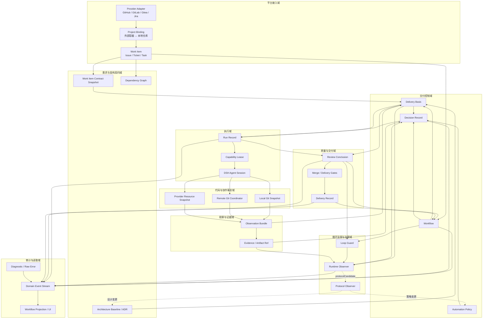
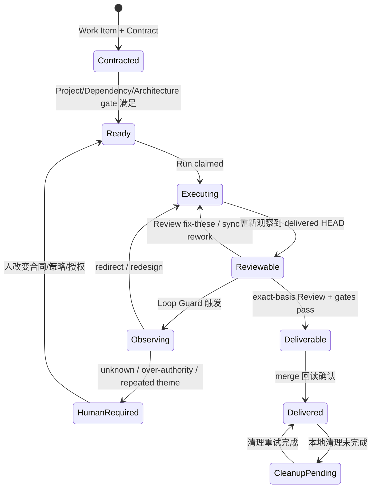

# ClickVibe Canonical Domain Model

> Status: Accepted | Parent: [当前有效架构](../architecture.md) | Decisions: [ADR-0006](decisions/0006-canonical-domain-model-and-contracts.md), [ADR-0007](decisions/0007-three-git-github-access-planes.md) | Detailed schemas: [核心数据契约](core-contracts.md)

## 目的

本文定义 ClickVibe 的目标共同领域语言：系统有哪些 Domain、各自拥有什么数据、彼此通过什么契约连接，以及哪些概念应长期稳定。它不规定数据库、文件布局或 TypeScript 文件位置，也不表示所有类型必须在 v0.2 一次实现；实际顺序由[产品演进路线](../roadmap.md)按真实消费者决定。

统一领域模型不等于建立一个全局超级对象。每个 Domain 拥有自己的数据；其他 Domain 只持有 identity、ref、冻结快照或明确 command/result。

## 稳定等级

| 等级 | 内容 | 演化规则 |
|---|---|---|
| A：长期稳定 | Identity、DeliveryBasis、Authority、generation/revision/sequence 语义、Decision→Action→Re-observe 因果链 | 变更必须新增或 Supersede ADR，并提供迁移 |
| B：版本化慢变 | Contract、Observation、Policy、Run、Review、ObserverResult、DeliveryRecord、Event payload | 持久化边界带 schemaVersion；默认做显式迁移 |
| C：可替换 | UI DTO、状态文案、缓存 TTL、prompt、provider/model、阈值、内部类和文件组织 | 可独立迭代，不得反向成为事实源 |

Provider 中立性在第二个真实 Adapter 完成前仍是设计假设。每个版本都要审计核心契约是否泄漏 GitHub 专属类型，但不得提前建设没有第二个消费者的 Adapter SPI 或插件框架。

## Domain 关系图



主因果链只有一条：

```text
意图与契约
→ 观察权威事实
→ 冻结证据与 DeliveryBasis
→ 按策略做一个决定
→ 执行一个动作
→ 重新观察
→ 追加事件并更新投影
```

Agent、缓存、Observer 和 UI 都不能绕过这条链直接宣布完成。

## Domain 职责与所有权

| Domain | 拥有的概念 | 唯一职责 | 明确不负责 |
|---|---|---|---|
| 平台接入 | Provider、External Container、WorkItem | 把 GitHub/GitLab/Jira 等外部表示映射为标准身份和资源 | 推导交付下一动作 |
| 需求与架构契约 | WorkItemContractSnapshot、ArchitectureBaseline、DependencyGraph | 冻结“做什么、按什么规则做” | 判断代码是否实现正确 |
| 代码与协作事实 | LocalGitSnapshot、RemoteGitCoordinator、ProviderResourceSnapshot | 读取/写回 Git、远端 Git 和平台事实；按各自作用域协调缓存与写入 | 把缓存命中当 current；建立万能中央队列 |
| 观察与证据 | Observation、EvidenceRef、ArtifactRef | 冻结一次读取和原始证据引用 | 决定是否 merge |
| 交付控制 | Workflow、DeliveryBasis、PolicySnapshot、DecisionRecord | 串行化状态变更并决定下一动作 | 执行模型推理或 shell |
| 执行 | Run、CapabilityLease、AgentSessionRef | 启动、监督和收敛一次开发/review/同步/Observer 动作 | 把 Agent 声明当系统事实 |
| 质量与交付 | ReviewConclusion、Finding、GateResult、DeliveryRecord | 对 exact basis 给出质量结论并确认交付结果 | 修改需求合同或架构 |
| 循环监督与治理 | LoopDecision、ObserverResult、ProtocolCandidate | 识别停滞，修正当前路线或提出协议变更 | 自动授予新权限或自批自改 |
| 审计与读取 | EventEnvelope、DiagnosticRecord、Projection | 保存因果链、原始错误并生成 UI 读取模型 | 成为业务写入入口 |

## 核心关系与基数

| 关系 | 目标约束 |
|---|---|
| Provider Instance → Project Binding | 一个实例可绑定多个外部容器/本地仓库 |
| Project Binding → Work Item | 一个项目包含多个 Work Item |
| Work Item → Workflow | 一个 Work Item 对应一个 Workflow；重试/返工/重开由 generation 和 Run 表达 |
| Workflow → DeliveryBasis | 每次 Decision、Run、Review、Observer 都冻结自己的 exact basis |
| Workflow → Run | 一对多；同一 workflow 任何时刻最多一个会改变共享状态的 active claim |
| Workflow → ReviewConclusion | 一对多；只有 exact basis current 的最新结论可进入 merge gate |
| Workflow → DecisionRecord/Event | 一对多、追加式、按 sequence 排序 |
| Workflow → DeliveryRecord | 最多一个当前交付结果；清理失败是该结果的后续状态，不回退 merge 事实 |
| Review history → Runtime Observer | Loop Guard 已停止且数据/策略允许时冻结一次跨轮证据；Observer 不常驻 |
| Runtime Observer → Protocol Observer | 只传 protocolCandidate；不得直接修改全局协议 |

如果未来需要一个 Work Item 同时驱动多个相互独立的交付，应新增显式 Delivery Slice 概念和 ADR；不能偷偷把 Run 当成第二个 Workflow。

## 身份、引用与定位地址

- **Identity**：跨运行稳定的逻辑身份，由 provider/instance/container/id 等组成。
- **Ref**：对另一个 Domain 对象的轻量引用，携带 identity 和必要版本。
- **Locator**：URL、本地 path、branch display name 等可变寻址信息。
- **Display key**：`#131`、`ENG-482` 等人类可读标签。

URL、worktree path、branch 名和显示编号都不能单独充当全局 identity。

## 生命周期



这是概念生命周期，不等同于当前 `WorkflowStage` 枚举。UI status 是从事实、控制状态和事件推导出的 Projection。

## 权威与写入方向

| 问题 | 唯一回答者 |
|---|---|
| 外部 Work Item 当前内容 | 对应 Provider Adapter 的最新 Observation |
| 本地代码、冲突和提交关系 | Local Git |
| 远端 refs、PR、Review、CI、merge | Remote Git / Provider（当前为 GitHub） |
| 当前 Run 是否仍有提交权 | workflow 命令域内的 active CapabilityLease/generation |
| 应执行什么动作 | 基于冻结 Observation、Policy 和 DeliveryBasis 的纯 Decision 逻辑 |
| Agent/Observer 是否完成 | 对其 Run 终态与外部副作用重新观察后的 ActionResult |
| UI 显示什么 | Projection；它不拥有写权限 |

## 失败与降级原则

1. 任何外部读取失败都产生 `unknown` Observation 或 DiagnosticRecord，不能合成为“没有依赖/任务已死/检查已通过”。
2. 动作返回成功只表示请求完成；必须重新观察目标事实。
3. generation、revision、sequence、round、step 是不同坐标，禁止互换。
4. 旧 schema 的兼容读取只用于迁移；新旧模型不得长期双写为两个事实源。
5. 原始证据保留 ArtifactRef，结构化摘要和分类标签不能覆盖原文。
6. 凭据值不进入任何核心契约；只保存 credential ref、provider/model 标识和脱敏后的诊断。

## 分阶段实施

1. **v0.2 可信访问与身份地基**：实现 WorkItemIdentity、ProjectBinding、WorkItemContractSnapshot、Local Git Snapshot、Remote Git Coordinator、GitHub REST Gateway、最小 DiagnosticRecord/ArtifactRef 和逐类迁移。WorkItemContract 在本版本落地，因为现有 `issueSnapshot` 已参与读取与授权，缓存 freshness 和旧授权失效直接消费它。
2. **v0.3 自主交付安全边界**：实现 DeliveryBasis、WorkflowControlState、generation、CapabilityLease、最小 Policy、判别式 EventEnvelope 因果链和纯规则 Loop Guard。v0.2 只保留并映射 legacy WorkflowEvent 的有效语义，不建立无消费者的完整自主事件总包。
3. **v0.4–v0.5 可恢复再并行**：先完成全因果链恢复与复盘，再扩大到同仓库多 Work Item 的 baseline、冲突和合并顺序协调。
4. **v0.6 介入产品化**：面板提供证据查看、指令修改和受控恢复；模型型 Runtime Observer 仅在数据证明能降低人工时间时启用。
5. 每一步都按资产决定保留、重构、迁移、归档或废弃；任何数据处置先有备份和回滚边界，已切换状态不得形成长期双写。

任何一步都不允许“为了迁移方便”恢复公开的无条件整对象写入口。
