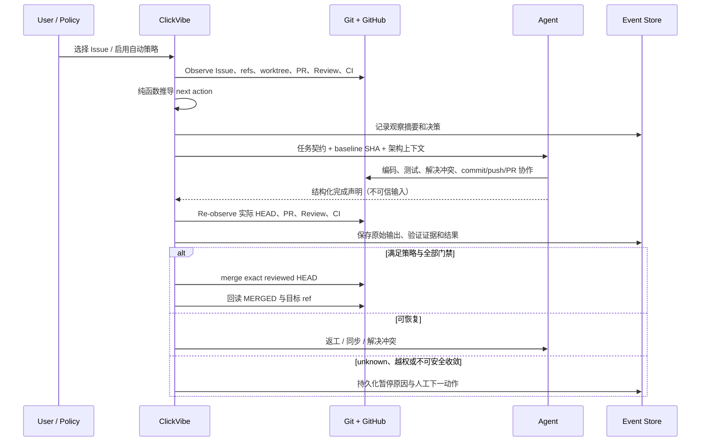
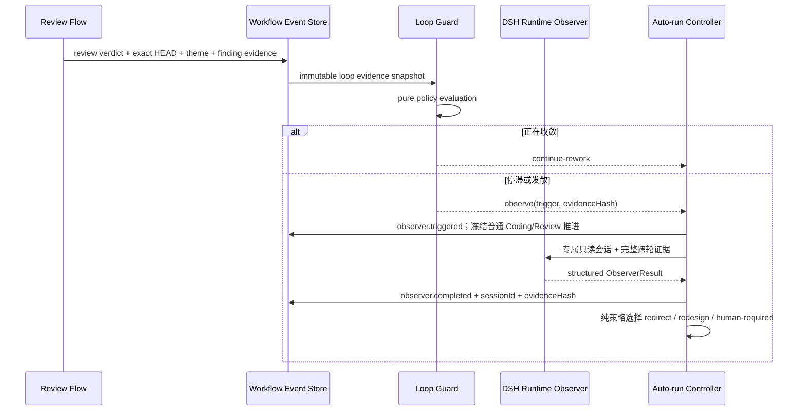

# 核心数据流

> Status: Accepted | Parent: [当前有效架构](../architecture.md)

## 主交付流



这条目标流不要求新增“架构服务”。它通过现有 workflow、github、agent、infra 四层收敛职责：Observe 统一读取，Decide 保持纯函数，Apply 复用 use case，Verify 统一回读。

## 循环监督流

每次 Review 结论完成写后回读并持久化后，Controller 必须先评估循环健康度，不能直接把失败意见再次交给 Coding Agent：



Loop Guard 只消费已经持久化的结构化事实；模型不决定自己何时被调用。Runtime Observer 的输入必须绑定 exact HEAD、Work Item 契约、架构 baseline 和完整 Review 历史。其输出是诊断证据与下一轮指令，不能覆盖 Git/GitHub/CI 事实或越过 merge 门禁。详细契约见 [循环监督与 Observer](observer-intervention.md)。

### Observer 结果的缓存边界

Observer 只允许按完整 `evidenceHash` 幂等复用。该哈希至少覆盖 Work Item 契约指纹、架构 baseline、各轮 exact HEAD、结构化 Review 结论和 Observer 策略版本。任一输入变化都必须重新运行；旧结果仍保留为历史证据，但不得决定当前动作。

## GitHub 读取与缓存

GitHub 请求统一经过 `src/github` 适配层。缓存只减少请求，不产生新的事实源：

| 数据 | 缓存策略 | 绕过/失效条件 |
|---|---|---|
| 仓库 Issue/PR 聚合 | 短 TTL + 并发请求合并 | 手动刷新、关键动作前强制读取 |
| 单 Issue/PR 详情 | 资源缓存；`updated_at` 未变时复用 | 对该资源写入成功后立即失效 |
| GitHub 限流状态 | 按账号/令牌的进程内熔断 | `Retry-After` 或 rate-limit reset 到期 |
| 合并与 Review 门禁事实 | 不依赖普通 TTL | 每次决策前强制读取 exact HEAD、契约和 GitHub 状态 |

写动作遵循：

```text
冻结目标与授权
→ 执行写入
→ 主动失效相关缓存
→ 回读 GitHub
→ 只有观察到预期事实才算成功
```

## 本地 Git 数据流

本地 Git 查询不进入 GitHub REST 缓存。一个刷新周期内可以生成不可变 `LocalGitSnapshot` 供多个纯函数消费，但下一次用户动作、任务完成、fetch/sync/merge 后必须重新采样。冲突现场是正式状态，不能通过 stash、reset 或删除 worktree 抹掉。

## 架构数据流

L2/L3 Issue 不能直接进入 Coding：

```text
业务 Issue
→ Architecture Impact
→ Design / ADR PR
→ 合入 baseline
→ Implementation Issue 绑定 baseline SHA
→ Coding / Review
```

这条链使并行 Agent 共享同一套慢变量，避免每个 Agent 各自发明事实源、缓存和权限模型。
