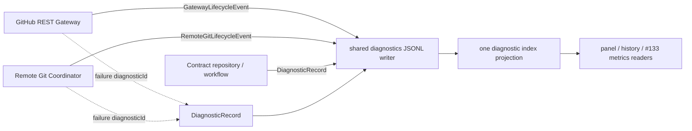

# ADR-0012：Work Item 契约规范化、原子发布与诊断证据

> Status: Accepted | Date: 2026-09-03 | Acceptance: user confirmed ADR and AC1 field mapping on 2026-09-03; effective only after merge to `main` | Issue: #136 | Refines: [ADR-0006](0006-canonical-domain-model-and-contracts.md), [ADR-0009](0009-v02-clean-break-local-state-and-config.md), [ADR-0010](0010-github-rest-gateway-admission-and-lifecycle.md), [ADR-0011](0011-remote-git-coordinator-admission-and-recovery.md)

## Context

ClickVibe 目前用 `IssueContractSnapshot.bodyHash` 判断“当前需求还是不是 Review 时那份”。这会把整个 Issue body 的排版、验收勾选和非契约章节都当成需求变化，同时 develop 授权仍比较 title/body/state/url 的另一套快照。读取、授权、Coding、Review 和 merge 因而没有共享同一个契约身份。

ADR-0006 定义了 `WorkItemContractSnapshot` 的方向，`core-contracts.md` 要求所有哈希固定 canonical serialization 与算法版本，但尚未决定字段、规范化规则、持久化原子边界、消费者迁移和未知版本行为。ADR-0010/0011 已经各自产生 Gateway/Remote Git lifecycle event；如果 `DiagnosticRecord` 再建立独立 writer、索引或面板入口，就会形成第三条平行证据通道。

#136 是 L3 变更。设计必须先回答：谁拥有“当前契约”、哪些变化使授权或 Review 失效、部分写入后读者看到什么，以及 v0.1 资产如何留在冷备份而不进入 v0.2 active state。

## Decision

### 1. 唯一应答源与事实边界

Provider Issue body、原生依赖关系和状态仍是外部事实。GitHub REST Gateway 负责观察这些事实，但不解释契约。一个 provider adapter 把一次完整观察交给 `WorkItemContractRepository`；repository 负责解析、规范化、计算 fingerprint、保存 raw artifact，并原子发布当前 capture。

运行时询问“这张 Work Item 当前是哪份契约”时，只能调用 repository 的 `readCurrent(workItem)`。以下行为禁止：

- `fetchIssueContract`、enrichment、authorize、develop、review 或 merge 各自重新计算 body hash；
- 从 prompt snapshot、评论 meta 或 workflow event 反推当前契约；
- 把缓存中的 Provider row 或 `updatedAt` 直接当成授权凭证。

`sourceVersion` 只用于观察和审计；`capturedAt` 只用于时间展示；`rawArtifact` 保存原始证据。三者都不是契约内容。Issue title、state、labels、comments、updatedAt 和 AC checkbox 状态也不属于契约 fingerprint；Issue state 等仍可作为独立准入事实阻止动作。

### 2. 快照结构与 unknown

v0.2 使用以下语义结构；字段缺失、冲突或不可解析时显式保存 `unknown`，不转换成空字符串或空数组：

```ts
type ContractUnknownReason = 'missing' | 'conflicting' | 'unparseable'

type ContractField<T> =
  | { state: 'known'; value: T }
  | { state: 'unknown'; reason: ContractUnknownReason }

type VerificationAuthority = 'agent' | 'human' | 'external'

interface AcceptanceCriterion {
  description: string
  verificationAuthority: VerificationAuthority
}

interface WorkItemContractSnapshot {
  schemaVersion: 1
  canonicalizationVersion: 1
  workItem: WorkItemIdentity
  sourceVersion: string
  goal: ContractField<string>
  acceptanceCriteria: ContractField<AcceptanceCriterion[]>
  nonGoals: ContractField<string[]>
  constraints: ContractField<string[]>
  dependencies: ContractField<WorkItemIdentity[]>
  architectureImpact: 'L0' | 'L1' | 'L2' | 'L3' | 'unknown'
  fingerprint: string
  capturedAt: string
  rawArtifact: ArtifactRef
}
```

`legacy-compatible` 是 Issue mutation 的治理状态，不是 snapshot schema 或 canonicalization 状态。存量 Issue 缺少非目标或约束时可以产生含 `unknown` 的合法 snapshot；需要这些事实的 impl-gate 必须停下。未知 AC 验证权、正文与原生依赖冲突、目标不可解析也产生 `unknown`，并阻止授权、Coding、Review 和 merge 沿用旧结论。

#136 AC1 中的字段名称按本 ADR 收口如下，避免实现自行取并集：

| Issue AC1 用语 | v0.2 归属 |
|---|---|
| identity | `snapshot.workItem` |
| revision | `snapshot.sourceVersion` |
| acceptance / dependencies | snapshot 的结构化 canonical fields |
| observedAt | `snapshot.capturedAt` |
| title / body / state | 同一原子 capture 中由 `snapshot.rawArtifact` 指向的 Provider 原始观察；不复制为 snapshot 顶层字段，也不进入 fingerprint |

因此“snapshot 保存 title/body/state”解释为 snapshot 通过 ArtifactRef 保存并可回读完整原始观察，不解释为领域快照再复制一套 Provider 字段。该映射是 AC1 的验收口径；本 ADR 合入 `main` 前仍不能作为 Coding baseline。

### 3. canonicalization v1

#### 3.1 指纹输入

fingerprint 只包含：

1. WorkItemIdentity；
2. goal；
3. AC 的 `description + verificationAuthority`；
4. 直接 dependencies；
5. nonGoals；
6. constraints；
7. 每个字段的 `known | unknown` 状态及 unknown reason。

明确排除 title、Issue state、body 原文、问题与证据、架构影响、Accepted 设计引用、AC checkbox、comments、labels、assignees、milestone、updatedAt/sourceVersion、capturedAt 和 ArtifactRef。问题证据的实质变化走 `framingAffecting` 并重跑 challenge；架构等级或设计引用变化走 `designAffecting` 并使 impl-gate receipt/实现授权失效，不另造 architecture fingerprint。

#### 3.2 文本规范化

所有 contract 文本在解析后依次执行：

1. 必须是可解码 Unicode string；非法输入为 `unparseable`；
2. Unicode 规范化为 NFC；
3. `CRLF` 和单独 `CR` 转成 `LF`；
4. 每行删除末尾 ASCII space/tab；
5. 删除开头和结尾的空行；
6. 保留行内空格、tab、段落换行、大小写和标点，不做自然语言改写。

规范化后为空的必填 scalar 是 `unparseable`。显式“无”由 adapter 解析为 `known []`；章节缺失是 `unknown/missing`。数组元素逐项执行相同文本规则；规范化后重复元素拒绝为 `unparseable`，不静默去重。

#### 3.3 顺序与序列化

dependencies 按完整 canonical WorkItemIdentity tuple 的 UTF-8 无符号字节顺序排序；AC 先按 `verificationAuthority` 的注册次序 `agent < human < external`、再按 description 的 UTF-8 无符号字节排序；nonGoals 和 constraints 按规范化字符串的 UTF-8 无符号字节排序。列表展示顺序不属于交付语义，因此仅重排不改变 fingerprint。

序列化使用无可选位置的注册 tuple，不依赖 object key 枚举顺序：

```json
[
  "clickvibe.work-item-contract",
  1,
  ["clickvibe.work-item-identity",1,"provider","instance","container","id"],
  ["goal",["known","..."]],
  ["acceptanceCriteria",["known",[["agent","..."],["human","..."]]]],
  ["dependencies",["known",[["clickvibe.work-item-identity",1,"...","...","...","..."]]]],
  ["nonGoals",["unknown","missing"]],
  ["constraints",["known",[]]]
]
```

tuple 由固定 JSON encoder 生成：UTF-8、无 BOM、无额外空白；引号、反斜杠和 U+0000–U+001F 使用 JSON escape（控制字符优先使用 `\b\t\n\f\r`，其余使用小写 `\u00xx`），其他 NFC Unicode scalar 直接编码为 UTF-8，不允许孤立 surrogate。数字只出现注册版本常量。禁止用 locale collation、平台换行、默认 serializer 的可选 escaping 或 object insertion order 决定字节。fixture 保存 canonical UTF-8 bytes，使其他语言实现逐字节对齐。

fingerprint 为：

```text
wic1_<base64url-without-padding(SHA-256(canonical UTF-8 bytes))>
```

`wic1_` 是 Work Item Contract canonicalization schema；SHA-256 + base64url-without-padding 是 `sha256-v1` hash policy。两条版本轴独立演进。算法、字段集合、排序或文本规则变化必须新增 `wic2_` 和新的 canonicalizer；不得在 `wic1_` 名下改变字节。snapshot schema 的兼容展示字段变化不要求改变 `wic1_`，但改变 canonical 字段语义必须同时升级。

### 4. 原子 capture bundle

每个 Work Item 在 v0.2 active state 使用：

```text
~/.clickvibe/state/work-items/<workItemKey>/contract/current.json
~/.clickvibe/state/work-items/<workItemKey>/contract/captures/<captureId>/snapshot.json
~/.clickvibe/state/work-items/<workItemKey>/contract/captures/<captureId>/raw.json
```

`workItemKey` 复用 #134 已实现的 `wi1_...` durable key；不得另用裸 Issue number、URL、`repoKey` 或 v0.1 workflow key 建第二棵目录。

`captureId = capture1_<base64url-sha256(raw canonical artifact bytes)>`。`snapshot.json` 的 `rawArtifact.path` 必须指向同一 capture 内的 `raw.json`，其 `contentHash` 必须与回读字节一致。raw artifact 保存该次 Provider Issue item 的完整返回字段和同次原生 dependency observation，并执行字段级脱敏；凭据不落盘。评论/timeline 若由独立请求取得，保存为关联的 Provider Observation/ArtifactRef，不复制进 canonical snapshot，也不构成第二个 IssueSnapshot。

发布者在每个 WorkItemIdentity 的既有跨进程 link-lock 原语下执行：

1. 在 `contract/` 下 exclusive-create 唯一 staging directory；
2. 写 raw → fsync；计算并回读 ArtifactRef；
3. 从同一 raw bytes 解析 snapshot、计算 fingerprint，写 snapshot → fsync；
4. 回读两文件并验证 identity、captureId、contentHash、fingerprint 和版本；
5. fsync staging directory，rename 为不可变 capture directory，再 fsync `captures/`；
6. 写新的 `current.json` temp，其中只有 schemaVersion、captureId、fingerprint；fsync 后 atomic rename/replace，再 fsync `contract/`；
7. 在锁内按 current pointer 完整回读 bundle，验证成功才返回。

`current.json` 是发布点。指针替换前失败，旧 capture 继续是 current；替换后，新指针只能指向已经完整发布的不可变 bundle。staging/orphan capture 不可授权，后续可由独立清理删除。禁止原地覆盖 snapshot/raw，禁止分别更新“当前 fingerprint”和“当前 rawArtifact”。

同 fingerprint 但 metadata/sourceVersion 变化可以发布新 capture；这更新证据而不使契约授权失效。并发观察按锁内再次比较 Provider sourceVersion 和 capture bytes：较旧或无法排序的观察不得覆盖已经明确较新的 current；无法判断先后时返回 unknown 并保留诊断，不能用最后写入者猜测事实。

### 5. 读取、授权、Coding 与 Review 迁移

本 Issue 必须在同一实现切片迁移下表入口并删除旧计算路径；接口/文件名可以在实现中按层规则调整，但语义消费者不得遗漏：

| 路径 | 当前持有者 | #136 后的唯一输入与判断 |
|---|---|---|
| Issue detail / repository enrichment | `fetchIssueContract`、`issueContractFrom`、`repository-state` | Provider observation 交给 repository 发布；展示和 derive 只读 `readCurrent` |
| develop/auto preview 与授权 | `issueSnapshot`、`sameIssueContract`、`authorizeAgent` | authorization 冻结 `workItem + contractFingerprint`；签发前 upstream-confirmed capture，消费时再次 upstream-confirmed 并比较 fingerprint |
| Coding/rework/resume prompt | `resolvePromptSnapshot`、workflow `issueSnapshot` | prompt 的可执行目标/AC/边界来自 current snapshot；raw artifact 仅供引用和上下文，旧 prompt snapshot 不授权 |
| Review 启动与结论 | `review-flow` 的 bodyHash | 启动前 upstream-confirmed current；结论保存 fingerprint；unknown 不启动 Review |
| derive/enrich/UI | `derive-from-facts` 的 `issueContract` | 比较 review fingerprint 与 repository current fingerprint，继续输出 current/changed/unknown |
| merge gate | `merge-gates` | upstream-confirmed capture 后比较 fingerprint；未知版本/读取失败保持现有 fail-closed 门禁 |

`IssueContractSnapshot.bodyHash`、`issueBodyHash`、基于 JSON stringify 的 `sameIssueContract` 和 workflow active `issueSnapshot` 均从 v0.2 active 路径删除。原始 title/body/comments 若仍用于展示或 prompt 辅助，只能来自本次 capture 的 raw artifact/Provider observation，不得作为第二个授权比较器。

本 Issue 不迁移 v0.1 cold backup，不创建 DeliveryBasis、WorkflowControlState、CapabilityLease 或完整 EventEnvelope；#137 才执行总体 cutover/终局验收。现有客户端 DTO 名称可保持以避免无关 UI 重写，但其服务端值必须来自 canonical fingerprint。

### 6. 失效接线，不建平行总线

fingerprint 变化只接入既有门禁：

| 旧证据/状态 | fingerprint 变化后的结果 | 既有机制 |
|---|---|---|
| 未消费的一次性 develop/auto authorization | 拒绝消费，要求重新 preview/authorization | authorization digest + consume-time refresh |
| 已启动 Coding | 不伪装成当前交付；下一 privileged stage、Review 和 merge 均停止 | stage-start refresh + current/changed/unknown |
| Review conclusion | `issueContractStatus=changed`、`verdictCurrent=false` | 现有 review 契约失效链 |
| Provider/Gateway cache | 不由 fingerprint 自建缓存；ClickVibe 写 Issue 后按资源 generation 失效 | ADR-0010 generation invalidation |
| contract repository current | 发布新 immutable capture 并原子换 pointer | §4 publication |

外部直接修改 Issue 无法主动通知本地时，普通展示可暂时复用 cache；所有签发授权、启动 Coding/Review 和 merge 的关键门禁必须使用 `upstream-confirmed`，因此旧 cache 不能授权副作用。AC checkbox、comments 或 updatedAt 单独变化会产生新 observation/capture 但 fingerprint 不变，不使旧授权或 Review 误失效。

### 7. DiagnosticRecord 与两条 lifecycle 流

DiagnosticRecord 是共享 diagnostics transport 上的规范错误记录，不是第三条事件流水线，也不包裹每一条成功 lifecycle event：



- GatewayLifecycleEvent 仍是 GitHub 请求计量的唯一来源；RemoteGitLifecycleEvent 仍是 Remote Git 计量的唯一来源。
- lifecycle 记录描述 declared/queued/dispatched/settled 等状态迁移；DiagnosticRecord 保存原始异常、stack、operation、classification、correlation 和可选 rawArtifact。
- lifecycle failure 通过 `diagnosticId` 引用一条 DiagnosticRecord；不得把同一请求重新编码为第三套 lifecycle，也不得从 DiagnosticRecord 反算 queue/service metrics。
- 三者复用 `appendDiagnosticLine` 的串行、轮转和 flush 生命周期，并使用显式 `recordType` 区分；面板和事件索引只读同一 physical stream/projection。
- 全局 Gateway/Remote Git 记录写 global diagnostics；Work Item 可归属错误写对应 issue diagnostics。索引可以联合查询，但不复制记录。

v0.2 不预建 v0.3 EventEnvelope。未来 EventEnvelope 落地时可引用相同 ArtifactRef/diagnosticId，但不得追溯改写 v0.2 JSONL。

### 8. 未知版本 fail closed

版本校验必须出现在三个边界，而不是只靠 TypeScript 类型：

1. `parseWorkItemContractBundle` 读取持久化 bundle 时，只接受 snapshot schema 1、canonicalizationVersion 1、`wic1_`、已知 ArtifactRef kind/hash policy；否则返回 typed unknown 并写 DiagnosticRecord。
2. `publishWorkItemContractCapture` 在替换 current pointer 前用独立 reader 回读并复算 canonical bytes/fingerprint；不匹配时保留旧 current。
3. authorization consume、Coding/Review start 和 merge gate 只接受 reader 返回 `known/current`；unknown version、unknown canonical field、损坏 pointer/artifact 一律停止，不降级到 body hash、空契约或旧 workflow snapshot。

旧版本 reader 看到未来 `wic2_` 必须保留 raw files、显示 unknown 并停止授权；新版本若要迁移 v0.2 正式 schema，必须依 core-contracts 的显式备份/迁移规则，不允许双写猜测。

## Algorithm ↔ Data Structure Cross-check

| 算法步骤 | 读取 | 写入 | 决策消费者 | 失败结果 |
|---|---|---|---|---|
| Provider capture | complete Issue + native dependency observation | immutable raw artifact | parser | incomplete → unknown |
| parse/normalize | raw bytes + registered v1 grammar | ContractField values | impl-gate/prompt/review | missing/conflict/unparseable |
| canonicalize/hash | normalized snapshot fields | canonical bytes + `wic1_` | authorization/review binding | unknown version → stop |
| publish | staged raw + snapshot | immutable capture + current pointer | all current-contract reads | old current remains |
| invalidate | old/new fingerprint | existing authorization/review state outcome | stage/merge gates | changed/unknown |
| diagnose | caught raw error | DiagnosticRecord in shared JSONL | panel/index/operator | evidence failure remains visible |

每个新增结构都有真实消费者：capture bundle 被 current reader 消费；fingerprint 被 authorization/Review/merge 消费；ArtifactRef 被 reader和诊断展示消费；DiagnosticRecord 被共享索引和面板消费。只被 fixture 做存在性断言、却不改变任何运行决策的字段必须删除。

## Required Verification

实现必须先提交失败 fixture/test，再做最小实现；不 mock canonicalizer、文件系统原子边界或 GitHub 业务路径。至少固定：

- 一份跨语言 golden fixture 的 canonical bytes 和 `wic1_` 值；
- CRLF/CR/LF、NFC、行尾空白和字段/列表顺序的等价性；
- 行内空白、目标、AC 描述、AC 验证权、依赖、非目标和约束变化会换 fingerprint；
- comments、updatedAt、title、labels、问题证据、architectureImpact 和 `[ ]`/`[x]` 变化不换 fingerprint；
- 缺章节是 unknown，显式“无”是 known empty，二者 fingerprint 不同；未知 AC 前缀与依赖冲突 fail closed；
- 未知 snapshot schema、canonicalizationVersion、fingerprint prefix/hash policy、损坏 raw hash 均返回 unknown 且零授权；
- 在 raw write、snapshot write、capture rename、pointer temp write、pointer rename 和目录 fsync 前后注入真实文件系统失败，证明读者只能看到完整旧 bundle 或完整新 bundle；
- 两个交错 publish 不产生新 snapshot + 旧 fingerprint，较旧 observation 不覆盖明确较新 current；
- authorization 签发后 contract 改变，consume 零启动；Review 后 contract 改变，现有 `verdictCurrent` 和 merge gate 失效；
- comments/updatedAt/checkbox 改变后，授权和 Review 仍 current；
- Gateway/Remote Git metrics 仍只从各自 lifecycle 派生，DiagnosticRecord 可关联但不会重复计数；共享 JSONL 写失败保留可观察的原始错误。

## Consequences

### Positive

- 读取、授权、Coding、Review 和 merge 第一次共享同一契约身份与唯一 current reader。
- 非契约元数据不再误杀授权或 Review，真正的目标/AC/边界变化仍 fail closed。
- 发布点只有一个原子指针，崩溃不会制造“新摘要配旧 fingerprint”。
- DiagnosticRecord 补齐错误证据，但不抢夺两条 lifecycle 的计量所有权。

### Negative

- Issue parser 必须显式表达 unknown，调用者不能再把缺字段当空数组。
- 每次关键动作多一次 upstream-confirmed observation 和 bundle readback；这是授权正确性的成本。
- 不可变 capture 会产生孤儿和历史文件，需要独立、保守的容量清理策略；#136 不自动删除证据。

### Neutral

- fingerprint 相同不表示原始 Issue observation 相同；它只表示可执行交付契约相同。
- title/state 仍影响 UI、Issue 是否开放等独立行为，但不参与 contract fingerprint。
- v0.2 仍使用现有 JSONL transport；完整因果 EventEnvelope 保持在 v0.3。

## Failure Modes

- **parser 与 hasher 各自规范化**：会产生同字段不同字节；canonicalizer 必须只接受已解析 ContractField，并导出唯一 golden fixture。
- **current 指向未完成 capture**：只允许先发布 immutable directory，再替换 pointer；reader 必须完整回读。
- **metadata 更新覆盖较新契约**：锁内比较 sourceVersion；无法排序时 unknown，不用 last-write-wins。
- **unknown 降级到 body hash**：禁止 legacy fallback；关键动作零授权。
- **外部 Issue 修改命中旧 cache**：关键门禁强制 upstream-confirmed；普通显示不获得授权能力。
- **DiagnosticRecord 变成计数器**：#133 metrics 只能消费两种 lifecycle；diagnostic index 不推导请求性能。
- **证据写入失败被吞掉**：原始写错误必须走当前可观察 fallback，并使需要 durable evidence 的 capture 发布失败。

## Alternatives Considered

- **继续 hash 整个 body**：拒绝；排版、checkbox 和非契约章节会误失效，也无法表达验证权与 unknown。
- **对排序后的 JSON object 做 hash**：拒绝；需要跨语言递归 key 规则，且未来新增非契约字段容易误入输入。注册 tuple 更小且可审计。
- **只 hash contract，不包含 WorkItemIdentity**：拒绝；相同文字可跨 Issue 误复用授权或 Review。identity 放入 tuple 后 fingerprint 可独立防重放。
- **snapshot/raw/fingerprint 三个文件各自原子覆盖**：拒绝；单文件 rename 不能保证三者是同一代。
- **把 raw body 内联进 snapshot**：拒绝；大型/Provider-specific 证据会污染领域快照并绕过 ArtifactRef。
- **所有 lifecycle 都转换成 DiagnosticRecord**：拒绝；会丢失 Gateway/Remote Git 的判别式状态机和唯一计量来源。
- **让 DiagnosticRecord 使用完整 EventEnvelope**：v0.2 拒绝；前置基础设施错误可能没有完整 DeliveryBasis，且会预建 v0.3 概念。

## References

- [Issue #136](https://github.com/ai-daming/clickvibe/issues/136)
- [Issue 证据契约](../../issue-contract.md)
- [核心数据契约](../core-contracts.md)
- [可观测性与复盘](../observability.md)
- [状态模型](../../state-model.md)
- [v0.2 本地状态与配置升级协议](../v02-upgrade-protocol.md)
