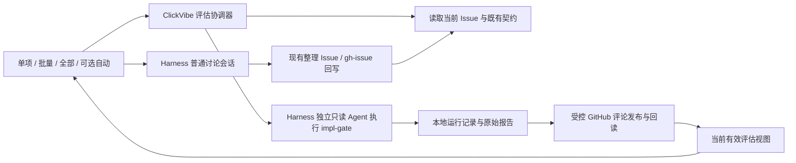

# ADR-0019：Issue impl-gate 评估与讨论回写

Status: Superseded by [ADR-0020](0020-advisory-issue-assessment.md)（随替代设计合入 main 生效）。以下保留历史，预算、批次订阅、READY 放行及发布绑定不再作为实施要求。
Work: ai-daming/clickvibe#177（updatedAt 2026-09-10T17:49:22Z）
Design investigation baseline: 82cf1bcc8a88b13c7c304eb62d44fd004ed70aea
Merged design: #178 at 15ee503e4846aa901e26e7d9539b831deed6c5e4；实施核验须另记当时的 exact main SHA。
Harness inspected baseline: aa8262ec091698bae9a6b04773a6b5b06ad4aef2

## 1. 目标与固定边界

复用 impl-gate 原始判断，提供单项评估、milestone 勾选批量/全部及可选自动触发，报告保存为 Issue comment。READY 无讨论按钮；明确需讨论事项才进入 Harness。未知/失败不是需求歧义。有效结果重启可复用；正文回写后按新依据核验。lead 识别、继承、编排及 milestone 整体验收不在范围内。

这是评估和交接能力，不是新的开发授权来源。现有 Git、任务所有权、合并等执行保护保留；与五字段准备检查的关系按已确认 D4 和 §9 执行，不能扩大为通用 unknown 豁免。

## 2. 最小构成

复用当前 GitHub REST Gateway、契约快照、文件锁/持久写原语与两个 UI 入口。不增加数据库、消息中间件、常驻父 Agent 或自创评分器。一个 root Agent 处理一份明确的评估输入；运行结束释放其执行资源。宿主能力作为评估域的可用性检查；缺少 agents/作用域工具限制/会话结果读取能力时，只显示评估不可用及原因，不让整个 ClickVibe 面板消失。

## 3. Harness 接入（静态已查证）

使用 ctx.agents.create，而不是模拟 composer 发送，也不依赖用户恰好有一个活跃父 Agent。CreateAgentOptions 允许省 parentAgent，并在 setup 中完成工具/提示词作用域配置后才发布 AgentHandle。SDK server 已用该入口创建会话，使用 createUserMessage + handle.agent.followup 提交有身份的消息。AgentHandle.dispose 负责停止/收敛释放。

subagents.start 则要求 parent Agent，因此不选它作为面板无对话时的首版入口。无需修改 Harness 本体；若对应版本不提供所需接口，评估功能明确不可用，不用未验证的替代接口凑成功。

setup 中屏蔽通用全局工具，只注册评估需要的受限读取适配器：本 Issue/明确引用的同仓库资料、冻结 Git 提交中的文件和 diff、完整 impl-gate skill 及 references。不要给任意 shell、Git 写入、GitHub 写入、子 Agent 派发或服务控制工具。tools.restrict 仅限制全局工具，scoped tools 需单独枚举；不能误以为 allow 空集已封住所有 scoped 能力。

source 输入固定为 Git 对象而非会变化的脏工作树。评估无需新建/清理业务 worktree。与目标无关的配置、凭据和本地私人文件不向模型暴露；引用输出采用 repo-relative path 或 GitHub URL，避免把宿主私人路径写进评论。

必须记录此次 prompt 的 messageId。whenIdle 只能证明当前 Agent 空闲，不能证明某个消息成功；结果收集须结合该消息对应的持久会话完成/失败记录、结构完整报告和未取消状态。已进一步查证 in-process driver 使用 session.snapshotEvents(boundary)、foldConsumedWork 的持久结束原因和 finalAssistantOutput 组合收集结果。首版对独立评估只允许本次一个输入：保存发送前 boundary 和 messageId；若混入额外输入或无法证明完成属于本次请求，拒绝发布。不能仅取最后一段文字。该路径仍须在实现验证中用真实隔离 Harness 跑通。

## 4. 评估依据与复用

每份报告绑定：Work Item 身份、现有 canonical contract fingerprint、问题证据/待决事项的规范化内容摘要、精确 Git base ref/OID、适用设计引用/内容摘要、impl-gate 和必需引用资源的包哈希。采用显式版本的序列化，仅用于识别本次评估依据，不替代 ADR-0012 的契约指纹，也不另造判分标准。

普通评论、评估 comment 自身、AC 勾选、纯标题/更新时间/milestone 名称变化不使评估循环失效。实质需求、问题证据、设计或基线变化后，旧报告为 stale；下一次入口运行 skill 的 delta 或 full 核验，不自动把旧结论改成新基线的 READY。相关内容的精确提取规则见 §16；无法证明未变时不宣称复用有效。由于 baseline 是精确 SHA，基线更新会要求重新核验，这个成本应明确，不以路径猜测跳过 gate。

报告显示有效性与执行授权分离。运行配置与模型来源记录在报告中；哪些模型/策略变更需要使旧结果失效，随 D2 配置方案一起确认。

## 5. 单项与批量算法

- 点击入口先取得目标身份；批量/全部固定本次目标清单，展示数量。“全部评估”按用户确认的语义覆盖该 milestone 的全部 Issue（包含 CLOSED，不受 ready 状态或页面分页限制），提交前显示总数量；“批量评估”仅覆盖明确勾选的 Issue。CLOSED 的评估不恢复其开发入口。
- 评估目标不使用 readyIssues 或开发队列的 MAX_BATCH_ISSUES：准备不足的 Issue 也必须能评估。选择评估不能签发 develop 授权。
- 对每个目标读取当前依据与已有报告：有效则 reused；同依据正在运行则加入观察而不另开；其余排队。新的相关依据使旧结果失效，迟到结果可保留为历史，但不成为 current。
- 首版同一安装单协调器、全局并发 1；所有入口共享它。单项失败不阻止其余项目，UI 区分 reused/queued/running/needs-attention/failed/published，不用单个“成功”覆盖部分失败。
- batch 只是一份 requestId + 目标列表和逐项 run 引用，不复制每项报告，不成为报告有效性的事实源。
- 取消批次只取消无人再观察/需要的未发布任务，不能把其它入口共同等待的任务一并终止；依照 §12 在同次状态更新中根据未取消请求确定订阅归属。

## 6. 本地状态与 comment

comment 是已发布报告的持久证据。本地小文件只管理设置、运行/发布恢复和 comment 引用，不建第二套需求库。不得直接扩展被升级指纹冻结的 config.yaml；优先在现有 active root 内新增隔离的评估域文件，并使用当前代次写入守卫。

逻辑最小记录（物理存储统一为 §12 的单个状态文件及不可变报告）：
- 设置：schema、项目启用范围、模型配置、预算、评论发布许可、配置 revision。
- 每个 Issue 的评估记录：schema/revision、basis、runId、sessionId/messageId、运行阶段、原始报告与 verdict、发布 marker/commentId/bodyHash、错误、必要时间信息。
- 批次清单：requestId、确定的目标身份及各自评估引用，供进度展示/恢复。
- 讨论关联：discussionSessionId 与原 Issue、评估依据/报告引用的固定映射，放在该 Issue 的评估域记录中；不借用 milestone 或 Agent 名字猜目标。

各记录的创建/转换在评估域的单个文件锁和 durable replace 下检查 revision/owner；异步回调带 runId+依据，只能结算自己的运行。GitHub 写前先存发布意图，不能锁外先检查再无凭证写记录。字段未知版本只禁用评估域并给出原因，不覆盖旧文件，也不借格式问题改业务状态。

评论正文以“身份：开发准备评估 Agent”开头，展示原始 gate 结论、人话说明、具体待决事项及依据；机器区标识 recordType/schema/Work Item/basis/runId/skillHash/reportHash。READY 还必须携带与本次身份/基线/设计一致的 VerifiedDesignReceipt；其它 verdict 不伪造 READY receipt。

来源核对同时依赖授权的 GitHub 发布身份和本机持久发布记录，不仅凭角色字符串或最新更新时间。正常重启可恢复本机记录并核对 comment；本地记录完全丢失或来自其它安装的未知报告不直接升级为可授权依据。跨机器复用/迁移不在首版范围内。

## 7. 发布、中断与重启

运行阶段候选：queued → running → result-stored → publishing → published；failed/cancelled/superseded 为明确结果。运行结束但还未发布的报告必须先本地持久化，这样发布问题不引发重新调用模型。

- 发布由控制器经既有 Gateway 执行，评估 Agent 不拿写工具。D3 已确认：评估许可包含目标报告评论；发布前仍核对许可未被撤销。
- 每份发布带唯一 run marker，评论内容在发布意图中固定。POST 返回并完整回读匹配后才记 published；旧依据报告不得成为有效 current。
- POST 超时/进程中断不等于没发出去。重启只查对应 commentId 或分页查唯一 marker 与内容，找到唯一匹配则补记；多个冲突或尚不能确认则保留 publish-unknown，只读重查，不盲目重发，也不重新评估。
- 现有 issue-comment-create 非重复写可复用，但其 maxPages=2 不足以保证任意历史长度下发现报告；明确区分“查询预算耗尽”和“不存在”，不能截断后认定可重发。
- queued 的已授权目标可恢复排队；running 先核对自身持久会话是否已有对应完整结果，没有则记 interrupted，绝不当作 READY。未完成运行不自动再花一轮模型预算，保留失败与重试入口；完整 published 且依据有效者不重算。
- 发布后 comment 被删改或内容与哈希不符，标 record-invalid，先核对本机已保存报告，不采信编辑后的任意 READY。
- 停用自动模式阻止新的自动入队，不等于取消已明确授权的手动批次。停用全部评估/撤销发布许可的效果需明示并体现在临界区校验。

## 8. 讨论和回写

创建普通 Harness 讨论会话，保留只读评估会话原样，不把评估 Agent 直接升级为可写 Agent。复用 #53 的工作区/会话桥，将原 Issue、报告及已确认结论带入；首版按 §16 导航并预填草稿、不自动发送，不能把仅导航当作消息已发送。

复用 #59 的整理 Issue，检测到受控来源的讨论绑定时，默认针对原 Issue 生成 gh-issue 变更预览。用户确认的是本次目标和语义变更；有覆盖授权则执行，无覆盖才问，不重复问已确认内容。回写前刷新正文与关系，对并发变化做比较，不能拿旧整篇正文覆盖别人更新。

回读成功后重新取得依据并评估；未写成功不得假设已解决，普通 comment 和勾选不当作需求改变。讨论记录不自动重定义当前契约。

## 9. READY 与授权（D4 已确认）

维护者明确回复“对，这个不用强制补充”。含义限定为：Issue 自身缺少非目标或约束，但适用的 Accepted 仓库设计已有明确依据，并且本次 impl-gate 给出有效 READY 时，不强制用户或 Agent 先把同样内容复制进正文。

新入口只覆盖 nonGoals/constraints 的 unknown/missing；不覆盖目标、验收标准、依赖的 unknown，不覆盖 conflicting/unparseable、不受支持的 schema 或证据读取失败。

授权前同时满足：
1. 当前目标仍为可执行状态，用户已授权本次动作；现有一次性授权、任务代次/占用、Git 和合并保护照常执行。
2. 最新 Work Item 身份、canonical fingerprint、base、设计与 skill 依据均与可信评估记录一致；报告为已完成且有效的 READY，并附匹配的 VerifiedDesignReceipt。
3. 每个缺失字段有报告中明确列出的适用 Accepted 设计引用和对应内容依据；只有“READY”文字、角色名或没有来源的概括不足以进入这个分支。
4. 开发和 review 的输入包含原 Issue、本次 gate 原始报告及绑定的设计资料；二者读取同一套已核验依据，不靠 Coding Agent 临时脑补。

canonical snapshot 中的 missing 保持原样，其现有 fingerprint 算法不变；不伪造 known []，不偷偷改 Issue。新记录识别本次评估依据，不取代 WorkItemContract，也不成为新的开发授权凭证。

控制器检查身份/版本/来源/报告完整性，不另实现语义评分器；具体设计是否充分仍由 impl-gate 作语义判断。执行前必须重新观察，不能把本地缓存或过期 comment 当权威授权。

如果没有有效评估，缺失字段不获得本项豁免；UI 说明需要评估或依据已过期，而不是承诺可开工后再报同一个已知缺口。对于原来五字段都已明确的手动入口，不额外偷偷加一条“必须先跑评估”的阻拦；普通开发仍遵守仓库既有实现准入规则。自动开发并不因本项获得新的权限。

本节是对 ADR-0012 既有 unknown canonical 准入的一处限定补充；其余分支不变。只有该设计经接受、合入并重新通过 impl-gate 后才实现。

## 10. 取舍、验证与交付

放弃前端模拟聊天；不用常驻父 Agent；不用新数据库；不按评论字符串或 checkbox 推断通过；不把一次 schema 校验当作 impl-gate 语义复核。

每项新记录都有生产消费者：设置约束入队/发布；Issue 记录约束复用/去重/回调；批次仅给进度；comment 与引用用于恢复/展示；讨论绑定用于回写目标。没有消费方的元信息不增加。

需验证：单项与批量对未 ready Issue 都可入评估；重复点击/多个窗口合并；新依据覆盖旧运行；读取和模型失败；完整结果跨重启复用；发布前后崩溃、分页预算与不重发；comment 伪造/修改/删除；技能缺失或 references 不完整；越权工具被拒绝；讨论准确目标与并发回写；READY/授权一致而运行任务的原保护不变。

先在隔离 Harness 上验证真实 SDK/会话完成机制，再做集成测试；不能用假的 handle/prompt 调用声称宿主接入已成立。产品运行环境仍由用户前台启动看日志，设计阶段不改它。

数据 schema 与转换契约、评论 marker/完整性、触发与预算、会话完成接口及讨论交互按 §3、§12–16 执行；D4 不再重问。实现后工程门禁、独立 review 和 #177 人工端到端 AC 必须分别完成。人工验收 owner/触发点需最终确认，不能把设计接受记成完成。

## 11. Grill 决策记录

Fixed：单项/批量/全部共用 impl-gate，自动可选，有效结果复用，lead 排除，评论保存，按 verdict 路由，回写原 Issue。
Confirmed D1（用户“行，这个没问题，继续吧”）：自动默认关闭，按项目显式开启。
Confirmed D2：模型与预算一次配置、后续复用；实际模型与数值由启用时选择，不在本轮替用户开启或消费。
Confirmed D3：发起评估的许可包含该目标的报告 comment 发布，不再逐项问；需求正文回写仍遵循 gh-issue。
Confirmed D4（用户“对，这个不用强制补充”）：非目标/约束 unknown/missing 可按 §9 的有效 READY 与明确 Accepted 来源进入原有授权流程，不强制重复补正文；其它 unknown/冲突及执行保护不变。
其它技术项由设计方继续查证并写明，不让用户选择 API 名称。

当前状态：D1–D4 已确认，完整设计经 #178 合入后获维护者确认继续。编码授权已给出；实施仍须在生效的 Accepted 基线上通过 impl-gate。

## 12. 技术收敛：存储与串行化

为避免“小规模场景却造跨文件事务”，首版使用 active root 下独立 `assessments/` 域：一个 `state.json` 管设置、请求清单、运行元数据及讨论绑定；较大的原始报告作为 immutable artifact。逻辑上的逐 Issue 记录存于该状态文件，不另建每张 Issue 的可变索引。

`state.json` schema=1，含 revision、settings、requests、runs、discussions。settings 含配置 revision、明确 provider/model/effort、单项及整批 token/时间上限、项目自动开关、发布身份/许可。输入/输出总量上限是预算控制，不在模型价格未知时承诺精确费用硬限。

request 含 requestId、来源(single/selection/milestone-all/automatic)、确定的 Work Item 身份列表、发起时配置/许可 revision、截止时间、取消标记，以及目标→runId 或 reused report 的引用。请求被接受时才固定目标，不根据之后 milestone 成员变化偷偷扩张。

run 含 runId、workItem、完整 basis、phase、ownerInstance/sessionId/messageId/boundary、deadline、reportRef/verdict/receipt（READY 才有）、publication、lastError。publication 固定 attempt marker、待发布 bodyHash、commentId、authorId、回读状态。大报告不复制到 batch。

同一个安装内所有写入经过单个评估存储锁，在锁内比较全局 revision 和对应 runId。先持久化 admission 再创建宿主 Agent；先 durable 写 report artifact、回读哈希，再原子替换 state 的引用。崩溃留下孤立 artifact 时不把它当有效结果，首版不自动删除孤立文件。模型和网络操作不持有文件锁；异步返回时携带 runId/basis/owner，重新进入临界区决定能否提交。

本机第二个宿主实例发现已有 live owner 时只读观察，不启动相同运行。死 owner 的锁回收不代表运行已经成功；恢复时查自己绑定的 Harness 持久记录。跨机器并行评估不在范围内。

批次取消在同一次 state 更新中移除该请求的有效订阅。仍被其他未取消请求引用的运行继续；无任何订阅的 queued 运行转 cancelled；无订阅的 running 由 owner 请求 cancel，再以宿主终态结算。已进入 publishing 的外部写不能靠取消假称未发生，保留发布回读流程。停用自动仅阻止新 automatic 请求；撤销发布许可会阻止尚未 dispatch 的发布，已经 dispatch 的只查回并记录。

## 13. 技术收敛：设置、调度、复用

已确认的默认值是“自动关闭”，不是“自动评估关闭时单项和批量也不可用”。首次使用明确选择 Harness 已配置路由和预算，确认报告将写到目标 Issue；没有配置时先展示配置入口，不用隐藏默认模型花费。

首版固定全局并发 1，FIFO 排队；相同 Work Item + basis 的多个请求合并引用，已经有效的 published 结果直接 reused。运行数、剩余请求预算和截止时间在创建 Agent 前检查；超限项目标明未运行，不把部分完成冒充整批成功。运行失败不自动多花一轮模型预算，首版由“重试”显式触发；它复用可用的来源信息，但产生新的 runId，保留原失败历史。

自动模式仅在所选项目列表使用期间发现缺失/过期目标时入队，页面后台定时器只查询进度，不每次启动新模型；离开页面不取消已接受请求。项目关闭页面后不维持无限全仓扫描。不扩大为 24 小时全仓服务。

“全部评估”按钮旁显示该 milestone 的完整目标数；当前筛选不改变“全部”，用户若只要子集则用勾选批量。先完整枚举成功再提交，分页/读取失败时不得把部分列表当成全部目标。CLOSED 仍可评估，但 UI 的真实业务动作由原状态保护决定。

报告的依据身份包含 Work Item、canonical fingerprint、问题/证据/待决章节的规范文本摘要、base ref/OID、设计引用及 skill 内容/资源哈希。模型路由、温度/effort、预算记录为执行来源，不因为调大超时时间就自动抹掉既有报告；skill/模型准入策略实质变化是否拒绝旧结果由带版本的可信来源策略明确处理。

## 14. 技术收敛：报告评论与读取

评论外观仍为既有 impl-gate 原文和身份说明，不改变 skill 的判断标准。程序只校验报告是否完整绑定本请求、verdict 是否在既有集合中、READY receipt 与输入/设计是否相符；格式校验不声称重新证明语义。

机器区使用明确版本和 recordType，例如 `clickvibe.impl-gate-report`，含安装/运行身份、依据及报告哈希。marker 用来定位一次发出的报告，不是授权密钥。可信 current 必须同时满足：本地确有对应 issued run、持久报告哈希匹配、GitHub 发布者身份符合许可、正文回读匹配、当前依据仍一致。伪造角色字符串不能新建本地 issued run。

重启只需要本地 state 与 GitHub comment 的读回，不调用模型。若 local state 丢失，保留 GitHub 历史供人阅读但不自动导入成授权依据；首版明确不承诺跨安装零重算。

读取优先按已知 commentId GET；POST 回应丢失才分页查 run marker。分页未完成/被限流是未确认，不是不存在。发现唯一匹配只补本地 publication；发现零条或多条仍保持待核实，不 blind POST。同一 run 的 comment 不自动改写；新依据报告保留历史，current 由本地有效依据选择，不取“最后一条写着 READY 的评论”。

## 15. 设计完成条件

当前技术方案已明确最小存储、串行化、取消、报告发布和复用主路径。D4 已确认并在 §9 限定授权与开发/review 输入的变化；设计接受与 impl-gate READY 分别记录。

逻辑记录和转换契约见 §16；实现类型必须忠实映射，不借类型细节增加新的判定标准。所有用户已确认条款保留在决策表；状态同步不执行实际评估或修改 GitHub Issue 正文。

## 16. 记录与转换契约

以下为实现应遵循的数据语义，不是已经运行的代码。用户四项选择已固定；评估设置的实际模型/数值在功能启用时由用户一次配置，不在设计阶段消费预算。

### 持久记录

- Store：schema=1、revision、installationId、settings、requests、runs、discussions。schema 未知时只报评估域不可用，不写入覆盖，也不破坏业务 workflow。
- Settings：revision、provider/model/effort、itemTimeoutMs/itemTokenLimit、requestTimeoutMs/requestTokenLimit、enabledProjects、publisherActorId、publicationPermission。正数预算必须受所选模型/宿主能力限制；无可信 token 消耗数据时不宣称费用硬上限已生效，应拒绝使用无法执行的预算配置。
- Basis：Work Item、现有 canonical fingerprint、contextDigest、baseRef/baseOid、skillBundleHash。contextDigest 对 Issue 正文采用既有 Unicode/换行/空白规范化后计算，忽略验收勾选位，不读取普通评论作为需求替代；把正文中的设计引用、问题与待决内容包含在内。provider 标题、updatedAt、milestone 名称不进入依据。所有代码、仓库规则、同仓库 Accepted 设计由 baseOid 的 Git 对象读取；无法纳入快照的外部必要依据返回 NEEDS_EVIDENCE，不静默忽略。
- Run：runId、basis、phase、ownerInstanceId、sessionId、messageId、eventBoundary、deadline、usedTokens、reportRef、publication、lastError。phase 固定为 queued/running/result-stored/publishing/published/publish-unknown/interrupted/failed/cancelled/superseded。verdict 独立存于报告，不拿 failed 代替 NEEDS_DECISION。
- Report：不可变 UTF-8 artifact，包含 impl-gate 原文、原 verdict、READY 时的原 VerifiedDesignReceipt、结构化来源引用及完整性摘要。引用必须能回到本次冻结的输入；原文不可被 publisher 美化改成另一结论。
- Request：requestId、来源、project/milestone 身份、固定 targets、target→run/report 引用、授权 settingsRevision、deadline、cancelled。进度从逐项引用读取计算，不持久化第二份“全部成功”。
- Discussion：sessionId、workItem、起始 basis/reportRef、首次消息身份。固定的是回写目标；对话内容不能自行把目标换成另一张 Issue。

### 主要转换（均使用评估域同一个存储锁）

| 命令 | 锁内前置检查 | 状态变化 | 锁外动作及返回检查 |
|---|---|---|---|
| submitRequest | 设置/发布许可有效，目标枚举完整 | 创建确定的 request；有效报告 reused，同依据已有 run 则加入引用，否则 queued | 不在提交阶段启动 Coding |
| claimEvaluation | run queued、仍有有效请求、owner 空、预算可执行 | running，记录 run/session/message 身份及截止时间 | 创建并限制 Harness Agent；返回按同 run/basis 提交，不能覆盖新依据 |
| settleEvaluation | owner/runId/basis 匹配，宿主完整结束属于本次消息 | 回读 immutable report 后 result-stored；取消/不完整输出则明确失败 | dispose 执行资源，失败证据保留；不从 idle 猜成功 |
| beginPublication | result-stored、许可有效、无已派发 attempt | 固定唯一 marker/bodyHash，先存 publishing 意图 | 只 dispatch 一次 POST；回读匹配才 published，未知则 publish-unknown |
| reconcilePublication | 持久 attempt 一致 | 唯一匹配回读补 published；冲突保留错误 | 只读 GET/分页，不按查无结果自动再 POST |
| cancelRequest | 请求存在且属于调用者已授权范围 | 取消订阅，无订阅 queued→cancelled | 无订阅 running 发取消并等待宿主结算；publishing 不虚构撤销外部写 |
| restoreAfterRestart | 已有 state 可验证 | published 复用；result-stored 继续发布；publishing 只查回；running 查持久消息结果，否则 interrupted | 不把重启当重新计算的触发条件 |
| openDiscussion | 目标与报告绑定可核验、用户点击明确入口 | 创建或复用对应普通会话关联 | 导航、预填已确认上下文；发送状态必须由宿主返回确认，不重复发送 |
| confirmWriteback | gh-issue 新鲜正文预览与现有授权覆盖 | 只在 GitHub 回读成功后记录新依据 | 新依据再评估，失败不冒充回写或 READY |

“当前评估”是当前输入与合法 published 报告的匹配视图，不是独立可变指针：任何输入变化即不再匹配。发布结果未知时可查看本地报告，但不当作已发布的有效结论。不能只按 comment 发布时间选 current。

### UI 与交接收口

Issue 卡片单独显示评估状态，不改开发 stage。未评估显示评估入口；排队/运行显示进度；有效 READY 按真实业务阶段展示当前开发动作且无讨论按钮；有明确待决事项才显示继续讨论。证据读取失败显示原因和重试，不画成需求歧义。

继续讨论使用现有公开会话桥，首版保留“导航并预填草稿，不自动发送”的已有契约；用户在 Harness 确认发送后开始讨论。评估报告与问题已带入，不要求重新抄写。若后续希望点击即发送，另按交互变更确认，不在这里无提示扩大入口行为。

整理 Issue 识别受控的 discussion 绑定时，优先把已确认结论合入原 Issue。没有绑定时继续保留当前通用整理功能；不能为了 #177 破坏其它对话中新建 Issue 的场景。回写仍按用户授权执行，评论报告不能自动变成需求正文。

### 兼容与交付

现有 config.yaml、工作流 schema 和 canonical 指纹算法不变；评估域新增文件仍受当前 active-root 写守卫保护。旧插件忽略评估域文件，不从 comment 推断新权限。禁用该能力后不静默删除评估历史；重新启用须核对依据。依赖限定 READY 入口的请求在能力不可用时不能沿用旧凭证。

ADR 索引、架构入口与 ADR-0012 同步引用 §9 的限定入口；仅替代该条件内的 unknown 拒绝规则，不另造第二套契约规范。

实测交付门槛：真实隔离 Harness 创建、只读工具限制、消息归属和取消；真实 GitHub 测试目标的 comment 发布/回读（须独立授权）；受控网络故障与重启窗口；UI 从评估到讨论/回写闭环。没有这些证据不能声称已实现。人工端到端验收在代码/隔离验证/独立 review 后一次集中进行，仍待维护者确认执行安排。

设计状态：Accepted，生效规则见 ADR 索引。维护者已请求 Coding；实施须在状态同步合入 main 后通过 impl-gate，不授权评估模型调用或重启服务。
