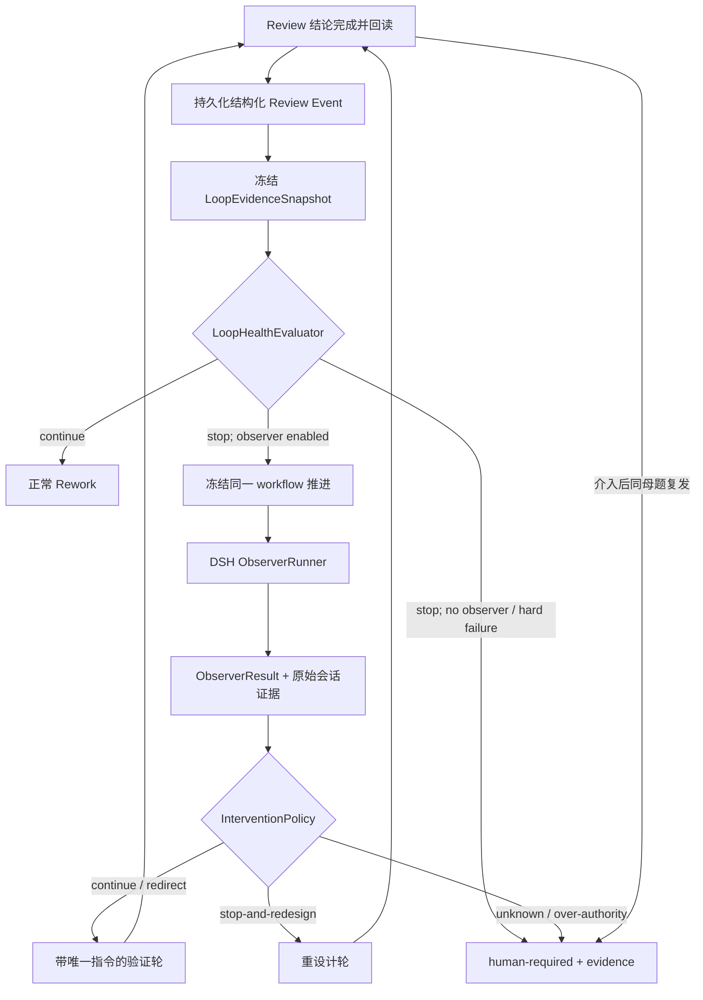

# 循环监督与 Observer

> Status: Accepted | Parent: [当前有效架构](../architecture.md) | Decision: [ADR-0008](decisions/0008-deterministic-loop-guard-and-optional-runtime-observer.md) | Schedule: pure Loop Guard in v0.3; intervention UX and optional Runtime Observer in v0.6

## 目的与非目标

Loop Guard 用于在 Coding → Review → Rework 循环停滞或发散时确定性停机。模型型 Runtime Observer 是 v0.6 的可选诊断增强：只有数据证明它能降低人工处理时间时，才在人工介入前独立验证关键 finding 并给出一个明确方向。它不是第三个代码 reviewer，不直接修代码，也不替代确定性门禁。

本设计不建设通用“AI 判断平台”，只定义 Observer 这一条真实纵向用例。第二个独立用例出现后，才从实际调用中提取通用 DSH Judgment Gateway。

## 两种 Observer

| 角色 | 观察范围 | 产出 | 是否进入单 Issue 循环 |
|---|---|---|---|
| Runtime Observer | 一个 workflow 的多轮 Coding/Review 证据 | `continue-rework`、`redirect`、`stop-and-redesign` 或 `human-required`，以及唯一指令 | 仅在 Loop Guard 已停止且数据/策略允许时介入一次 |
| Protocol Observer | 多个任务重复出现的系统性工作方法缺陷 | ADR、prompt/Skill/门禁候选和验证计划 | 否；作为独立架构变更执行 |

Runtime Observer 可以提出 `protocolCandidate`，但不得直接应用。只有跨任务证据足够时，Protocol Observer 才创建独立设计与实现工作。

## 组件与职责

| 组件 | 层次 | 职责 |
|---|---|---|
| `LoopHealthEvaluator` | workflow 纯逻辑 | 从冻结证据推导 `continue / observe / human-required` |
| `ObserverRunner` | DSH/Agent I/O 适配 | 创建专属会话、提交 prompt、等待对应 turn 终态、保存原始结果 |
| `InterventionPolicy` | workflow 纯逻辑 | 把结构化 ObserverResult 映射为返工、重设计或人工升级 |
| workflow 命令域 | 持久化边界 | 冻结推进、claim Observer generation、提交/拒绝结果、恢复下一动作 |
| Protocol Observer | 独立治理流程 | 跨任务汇总 protocolCandidate，不消费当前任务的交付权限 |

## 数据流



## 触发策略

Loop Guard 在每次 Review 事件持久化后执行。v0.3 的最小策略为：

1. Review 明确给出 `stop-and-redesign`：立即停止自动返工。
2. 同一 CRITICAL `theme` 连续两轮出现：立即停止自动返工。
3. 本次 auto-run 连续三轮 Review 未通过：进入下一轮前停止。
4. 修复 diff 连续两轮净增长，且高优 finding 集合没有缩小：停止。
5. 人显式要求暂停或观察：永远允许，不需要满足量化阈值。

第 2～4 条需要结构化证据；若旧 Review 只有自由文本而无法可靠分类，结果为 `unknown`，不能假装没有复发。阈值可由版本化项目策略调整，但不能由 Observer 会话自行改变。

没有启用 Runtime Observer 时，上述停止直接进入 v0.3 最小 `human-required`，保存触发规则、最低完整证据和明确下一步。启用 Runtime Observer 时，停止可以进入一次只读观察；一次介入只允许一个带指令的验证轮。验证轮仍出现相同母题，或 Observer 不能验证关键 finding、输出无法解析、请求超时、需要扩大权限/修改业务合同，立即进入 `human-required`。

## 输入契约

```ts
interface LoopEvidenceSnapshot {
  schemaVersion: 1
  workflow: WorkflowIdentity
  generation: number
  basis: DeliveryBasis
  rounds: Array<{
    round: number
    review: ReviewConclusion
    diff: { files: number; insertions: number; deletions: number }
    runIds: string[]
  }>
  policyVersion: string
  rawArtifacts: ArtifactRef[]
  evidenceHash: string
}
```

`WorkflowIdentity`、`DeliveryBasis`、`ReviewConclusion` 和 `ArtifactRef` 使用[核心数据契约](core-contracts.md)中的定义，不在 Observer 域复制第二套 workflow key、SHA 或 evidence 语义。`evidenceHash` 由除自身外的完整冻结输入生成；Review 自由文本与原始任务日志通过不可变引用进入证据包，结构化摘要不能替代原文。

## 输出契约

```ts
interface ObserverResult {
  schemaVersion: 1
  workflow: WorkflowIdentity
  generation: number
  basis: DeliveryBasis
  evidenceHash: string
  progress: 'converging' | 'stalled' | 'diverging' | 'unknown'
  verdict: 'continue-rework' | 'redirect' | 'stop-and-redesign' | 'human-required'
  verifiedFindings: string[]
  recurringThemes: string[]
  directive: string | null
  evidence: ArtifactRef[]
  protocolCandidate?: string
  rawOutput: ArtifactRef
  completedAt: string
}
```

`redirect` 和 `stop-and-redesign` 必须携带一个可验收的唯一 `directive`；多选项建议、空泛反思或没有验证证据的“继续尝试”按无效结果处理。ObserverResult 不是 merge verdict，也不能提升 Review 或缓存的权威等级。

## 正交状态与写入凭证

```ts
interface LoopControlState {
  schemaVersion: 1
  phase: 'normal' | 'observing' | 'redirected' | 'human-required'
  generation: number
  trigger: string | null
  basis: DeliveryBasis | null
  evidenceHash: string | null
  observerTaskId: string | null
  observerSessionId: string | null
  verdict: ObserverResult | null
}
```

`loopControl` 与交付 stage 正交。启动 Observer 时，命令域原子地签发 generation、保存 evidenceHash、注册 task/session，并冻结同一 workflow 的 Coding/Review claim。完成回调必须在临界区验证 generation 与 evidenceHash；任何不匹配都是迟到写入，保留事件但拒绝改变当前状态。

## DSH 执行边界

- Runtime Observer 使用任务专属 DSH Session，不复用用户当前 Chat、Coding Session 或 Review Session。
- 调用发生在宿主侧，浏览器关闭不影响执行。客户端 `conversation.send` 只能作为交互入口，不能成为后台控制器依赖。
- 提交 prompt 成功只表示 Host 接受；Runner 必须等待对应 turn 终态并提取最终 assistant message。
- 默认只读 workspace 和验证性工具权限；任何写代码、push、merge 或协议修改请求均拒绝并升级。
- 每次调用冻结 provider/model、prompt/策略版本、预算、timeout 和工具策略，并落入事件链。

## 幂等、缓存与预算

- 相同 workflow generation + evidenceHash 只允许一个活跃 Observer 任务；重复 reconcile 复用同一任务。
- 只有完整 evidenceHash 相同时才能复用已完成结果。HEAD、契约、Review 历史、架构 baseline 或策略版本变化即失效。
- 每个 workflow 默认最多一次自动 Observer 介入和一个验证轮；需要再次观察时升级给人，避免 Observer 自己形成新循环。
- Observer 使用独立时间/token 预算；预算耗尽产生可审计的 `human-required`，不能降级为普通 Rework。

## 失败模式

| 失败 | 处理 |
|---|---|
| DSH/模型不可用、超时或取消 | 保存原始错误，进入 `human-required`；不自动回到 Rework |
| Observer 输出无法解析或没有唯一指令 | 记录无效输出，进入 `human-required` |
| Observer 读取的 HEAD/契约过期 | 拒绝提交，重新 Observe；若当前证据仍满足触发条件，再启动新 generation |
| Observer 与普通 auto-run 并发 | Observer claim 成功后普通 Coding/Review claim 必须被构造性拒绝 |
| Observer 建议越过权限或 merge 门禁 | `InterventionPolicy` 拒绝并记录 authority violation |
| Runtime Observer 反复提出同一 protocolCandidate | 不自修改；跨任务聚合后创建 Protocol Observer 工作 |

## v0.3 与 v0.6 的边界

1. **v0.3 最小证据与停机**：扩展 Review 事件，落 `theme/verdict/finding identity/diff`；实现纯 Loop Guard；暂停时持久化原因、最低完整证据和明确下一步。v0.3 不建设证据浏览、指令编辑和恢复交互。
2. **v0.6 介入产品化**：面板展示冻结证据与失败母题，允许人在受控边界内修改指令、选择恢复点，并在恢复前重新观察权威事实。
3. **v0.6 可选 Runtime Observer**：只有 v0.3–v0.5 的 Loop Guard 触发率、人工介入时间、诊断命中率、误导率、成本和延迟证明有效时，才接入宿主专属会话、结构化输出、generation fencing 和一次验证轮。
4. **v0.8 协议演化**：跨任务聚合 protocolCandidate，启动独立 Protocol Observer；全局协议变更仍走设计、Review 和 merge。

模型数据不达标不影响 v0.6 介入产品化发布，也不阻塞 v0.7。任何阶段都不得让 Observer 获得修改代码、解除冻结、授权写入或决定合并的权限。
