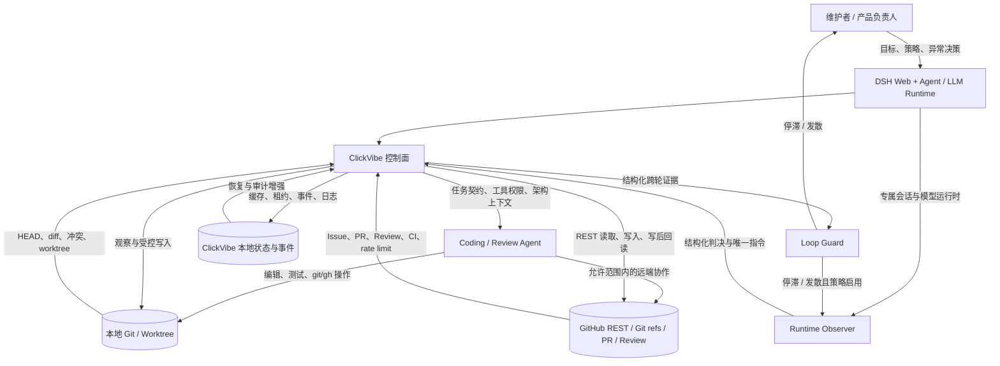

# 系统上下文

> Status: Accepted | Parent: [当前有效架构](../architecture.md)

## 边界图

## 责任边界

| 参与者 | 负责 | 不负责 |
|---|---|---|
| 人 | 业务目标、架构取舍、策略授权、无法安全收敛时的决定 | 为每次常规开发、冲突和合并重复点击 |
| ClickVibe | 冻结契约、读取事实、推导动作、调度 Agent、执行策略、保留证据 | 判断 Issue 是否产生业务价值 |
| Loop Guard | 根据持久化轮次证据确定性判断继续或停止，并保存触发原因 | 调用模型解释问题；修改代码或事实 |
| Agent | 在 Issue 范围内编码、测试、review、解决冲突、使用必要的 git/gh 工具 | 把自己的完成声明当成系统事实 |
| Runtime Observer | 数据证明有效且策略启用时，在独立 DSH 会话中审计跨轮收敛性、验证关键 finding、给出一个介入判决 | 直接修改业务代码、自动修改全局协议或授予 merge 权限 |
| Protocol Observer | 跨任务审计重复的系统性盲区，提出协议、门禁或架构变更 | 参与单个 Issue 的日常 Coding/Review 循环 |
| DSH | 提供 ClickVibe 宿主、专属 Agent 会话和可选的一次性 LLM 调用 | 替 ClickVibe 决定事实权威、工作流权限或合并门禁 |
| Git | 本地代码、分支、worktree、冲突和提交关系 | GitHub Issue/PR 的远端协作状态 |
| GitHub | Issue/PR/review/CI/远端 refs 和最终 merge 事实 | ClickVibe 本地任务是否仍由当前进程拥有 |
| 本地状态 | 会话、租约、日志、事件、缓存和恢复线索 | 覆盖 Git/GitHub 的原生事实 |

## 部署边界

v0.2 仍是 local-first 单宿主控制面。DSH 插件只接受本机回环、同源和专用请求头；跨机器执行属于后续独立架构问题，不能通过把当前面板直接暴露到公网解决。v0.6 若启用 Runtime Observer，它必须由宿主侧任务驱动并使用任务专属会话；不能依赖浏览器保持打开，也不能向用户当前 Chat 隐式发送消息。
