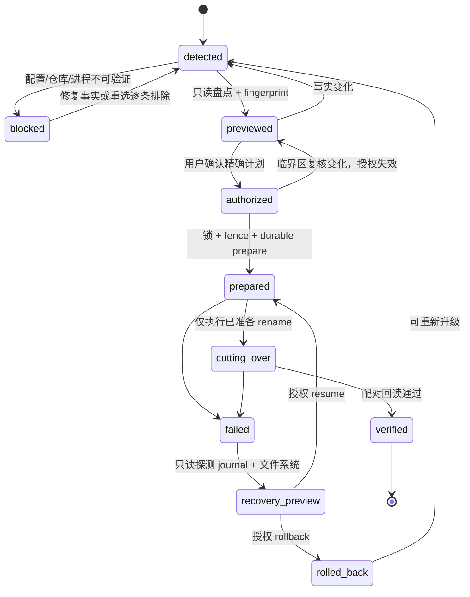

# v0.2 本地配置与状态升级协议

> Status: Accepted | Decision: [ADR-0009](decisions/0009-v02-clean-break-local-state-and-config.md) | Scope: v0.1 local config/state to v0.2 clean break

本文是 #134 Slice 2 的实现规格。它只处理 ClickVibe 本地配置、state、仓库绑定和升级恢复；Git worktree、branch、commit、dirty/conflict 与 Provider 事实只观察、不搬迁。

## 1. 事实源与不变量

- v0.1 config 的原始字节、hash 和解析结果共同定义升级输入；解析失败不能按默认空配置继续。
- v0.1 state 的路径身份、目录清单、文件数、字节数和 hash 清单定义待冷备份输入；`ENOENT` 是显式观察值，不自动等于空状态。
- Git common-dir 与其中的 `clickvibe/repository-id` 回答 clone 身份；config 只保存 expected pin。
- upgrade journal 是阶段事实源；文件系统回读用于验证 journal，不得用“看起来像成功”覆盖 journal 的未知或损坏状态。
- preview 零写入；authorization 只授权一个完整 plan fingerprint。
- authorization 后到 `verified` 或 `rolled_back` 前，升级器必须独占升级锁并持有宿主进程代次门禁。
- 任何 unknown schema、损坏 journal、部分切换或 identity mismatch 都禁止普通 v0.1/v0.2 写入。
- v0.1 config/state 必须成对可运行，或 v0.2 config/state 必须成对可运行；不允许把混合代次解释成空项目。

## 2. 固定路径与保留策略

| 资产 | 路径 |
|---|---|
| active config | `~/.clickvibe/config.yaml` |
| config cold backup | `~/.clickvibe/config-v0.1-backup-<timestamp>-<nonce>.yaml` |
| active state | `~/.clickvibe/state` |
| state cold backup | `~/.clickvibe/state-v0.1-backup-<timestamp>-<nonce>` |
| staged v0.2 config | `~/.clickvibe/config-v0.2-staging-<nonce>.yaml` |
| staged v0.2 state | `~/.clickvibe/state-v0.2-staging-<nonce>` |
| upgrade journal | `~/.clickvibe/upgrade-v0.2.json` |
| cross-process lock | `~/.clickvibe/upgrade-v0.2.lock` |

所有 backup/staging 名称在 preview 中确定并进入 fingerprint，使用 exclusive create，禁止覆盖或跟随 symlink。config backup 与 state cold backup 不自动删除；删除必须是本 Issue 之外的独立预览和授权动作。成功或回滚后 journal 仍保留用于审计。

## 3. 升级锁与旧运行时代次门禁

### 3.1 两种机制缺一不可

升级锁负责阻止两个 v0.2 upgrader 并发。实现复用 `src/infra/workflow-persistence.ts` 的 link 型跨进程锁模式：候选文件写入完整 owner token 后通过 hard link 争抢固定锁。schema 1 旧 owner 的启动字符串受 locale/timezone 影响：PID 存活时一律不抢，只接受 `ESRCH` 明确死亡；schema 2 owner 使用固定 `LANG/LC_ALL=C`、`TZ=UTC` 的启动身份，PID 对应 zombie 或启动身份变化时才按 PID 复用回收。锁 token、PID、进程启动标识和 plan fingerprint 写入 journal，身份读取不明继续 fail closed。

锁本身不能约束不认识它的 v0.1 二进制。因此 apply 还必须取得宿主提供的 generation fence：

1. 阻止宿主再启动任何 v0.1 task/job 或旧插件进程；
2. 等待现有 v0.1 host、agent 子进程和 live job 全部退出；persisted `running` 只作警告，不能代替活性检查；
3. 在 fence 内重新枚举进程和任务，并重新计算完整 plan fingerprint；
4. 持有 fence，直到 v0.2 bundle 已替换旧入口且升级进入 `verified`，或旧 config/state 已配对恢复为 `rolled_back`。

如果安装环境不能证明“旧入口已停用且不会在临界区重启”，apply 必须拒绝，要求关闭宿主后由离线升级入口执行。直接再次运行已被替换的 v0.1 二进制属于显式 downgrade：必须先走 rollback preview/authorization，不能把 v0.2 state 当作空 v0.1 state 打开。

未来的在线宿主集成必须提供三个动作：原子关闭 legacy start entry、独立确认该关闭仍生效、按升级终态恢复旧入口或完成新 bundle 接管。fence 在关闭入口后同时读取宿主 live task/job 与操作系统进程表，等待全部退出，并在进入 prepare 前再次确认入口仍关闭。只传入一份调用方声称为空的 activity 列表不构成 fence；缺少任一宿主动作时只能拒绝在线 apply。

当前 Slice 2 只开放离线 factory：操作者必须显式声明 DSH 宿主已经停止且升级期间不会重启；factory 同时枚举 argv 可识别的独立 legacy 进程作为第二信号。进程内插件无法由 `ps` 的 argv 证明，因此这份离线声明是操作边界，不得包装成在线证明。在线 factory 在宿主 capability 真正接线前固定拒绝；`apply`/`resume`/`rollback` 还会在创建锁候选文件前拒绝任何调用方自造的 fence 对象。

旧进程长期持有已打开文件描述符是 cutover 的危险窗口：仅看路径名无法发现它仍可向 rename 后的 cold backup 写入。因此进程退出必须发生在 state rename 之前；最终 verify 还必须重新计算 cold backup 的 inode、文件数、字节数和内容 hash。任一项漂移都不得写 `verified`。内容校验是第二道伤害检测，不替代先停旧进程，因为已污染的 backup 可能无法自动 rollback。

### 3.2 临界区顺序

apply 的顺序固定为：验证 fence 来自批准 factory → 取得升级锁 → 取得 generation fence → 临界区内活性检查 → 重算 fingerprint → 写 durable journal → prepare → cutover → read-back → `verified`/`rolled_back` → 释放 fence 和锁。失败时必须先把原始错误和当前阶段写入 journal，再尝试释放 fence 和锁；两个释放动作都必须执行，任一释放失败都向调用方报错。新进程看到未完成 journal 时只能进入 recovery。

### 3.3 人工处理残留锁

只有在自动 recovery 因 `upgrade-v0.2.lock` 残留而无法取得锁时才进入人工处置；journal、backup 和 staging 资产都不得随锁删除。

1. 停止 DSH 宿主和所有 ClickVibe 升级命令，确认处置期间不会自动重启。
2. 读取 `~/.clickvibe/upgrade-v0.2.lock`，记录 `schemaVersion`、`token`、`pid`、`acquiredAt` 和 `planFingerprint`；文件不是普通文件、JSON 损坏或字段不全时停止，不猜测 owner。
3. 用操作系统进程查询同时验证该 PID 不存在；只有明确得到 `ESRCH`/“no such process”才可判定 owner 已死。PID 存活、权限不足或查询结果不明时禁止删锁；schema 1 的 `processStart` 不参与人工死亡判断。
4. 删除前再次回读锁文件，确认 token 与第 2 步一致，避免删掉刚接管的新 owner。随后只删除精确路径 `~/.clickvibe/upgrade-v0.2.lock`，不得使用通配符或递归删除。
5. 重新运行只读 recovery preview。存在未完成 journal 时只能按其精确 fingerprint 授权 resume/rollback，不能当成全新升级。

## 4. repositoryId 与 Binding 准备

repositoryId 最终文件为 `<git-common-dir>/clickvibe/repository-id`。首次创建必须保证内容原子，而不只是“路径抢占成功”：

1. 在同一 `clickvibe/` 目录 exclusive-create 唯一 temp；
2. 写入完整 `repo_<UUID>`、设置权限并 fsync temp；
3. 用 hard link 将完整 temp 竞争性发布到最终路径；
4. fsync `clickvibe/` 目录并删除 temp；
5. 失败者读取、校验赢家的完整内容。空、半写、格式错误或 symlink 最终文件一律 fail-closed，禁止自动覆盖。

路径移动不改变 ID。`cp -r` 整个 clone 会复制 sidecar，因此 preview、启动和每次高风险动作都必须检查目标 config 内 repositoryId 唯一：同一 ID 指向不同 real common-dir 时，两条 Binding 都不可写。用户必须选择其中一个 clone 进行独立的 regenerate/rebind preview；该动作生成新 ID、重算 bindingId，并要求没有其他 Binding 仍引用旧的 common-dir/ID 配对。

v0.2 active Binding 只接受有工作树的顶层 repository。bare repository 和 submodule 在当前 Slice fail-closed，不创建 ID；支持它们需要新的真实需求和边界设计。

## 5. config schema 1 转换

顶层 config schema 1 保留当前有效的非仓库设置：

```yaml
schemaVersion: 1
worktreeRoot: /Users/example/.clickvibe/worktrees
fetchTtlSeconds: 45
diagnosticsMaxBytes: 10485760
projectBindings: []
```

- v0.1 显式 `worktreeRoot` 规范化后原值保留；缺失时固定为 `~/.clickvibe/worktrees`。§8 worktree collision guard 只使用这个目标值。
- `fetchTtlSeconds`、`diagnosticsMaxBytes` 在现有合法范围内原值保留；缺失则继续使用运行时默认值，非法则 preview 阻断，不静默丢弃。
- 每个可验证的 `repos[owner/repo] = localPath` 转成一个 ProjectBinding，并显式选择/验证 `primaryRemote`。
- 当前机器同一 container 只能有一个 active Binding，repositoryId 在目标 config 中也必须唯一。

一个已删除 clone、未挂载卷或其他无法验证的 v0.1 repos 条目不再阻塞其余条目，但绝不能被静默丢弃。preview 必须逐条列为 `blocked`，用户可修复后重试，或显式选择 `exclude`；排除项的旧 key、path、观察错误、选择理由和 hash 都进入 plan fingerprint/journal。目标 config 不包含被排除条目，旧 config backup 永久保留原值。

## 6. 版本轴

- canonical tuple 中的 `1` 与 `wi1_`/`pb1_` 表示各自序列化 schema version；两种 tuple 独立演化。
- config `schemaVersion: 1` 表示 config schema，和 tuple 版本、产品 v0.2 无绑定关系。
- `sha256-v1` 表示 hash policy version；它规定 digest/base64url 细节，不等于上述任一 schema version。

版本不匹配必须显式迁移，不能因数字恰好相同而联动升级。

## 7. 状态机



已存在未完成 journal 时，它优先于全新 preview。系统不得重新扫描后覆盖旧 journal，也不得假装第一次升级；只能展示 recovery preview。

## 8. Preview 与 plan fingerprint

preview 至少包含：baseline SHA；旧 config 原始 hash、完整目标 config、固定 backup/staging 路径；旧 state 是 present/absent/error、目录身份、文件数/字节数、cold backup；每个 Binding 的 container、real localPath、real common-dir、repositoryId、primaryRemote；重复 ID；逐条排除；宿主/进程活性；完整 `git worktree list` 现场；所有将创建、link、rename、replace 的路径。

fingerprint 覆盖上述全部内容、升级器版本和预期起始 journal 状态。apply 在锁与 generation fence 内重新读取所有输入；任何变化走 `authorized → previewed`，且在 durable journal/sidecar/backup 产生前结束。

## 9. Durable prepare 与 cutover

### 9.1 原子持久化配方

journal、config backup、staged config 和所有 schema marker 都使用同一配方：在目标同目录 exclusive-create temp → 写完整内容 → 权限收紧为不宽于原 config（新文件默认 `0600`）→ fsync 文件 → rename/link 发布 → fsync 父目录。更新 journal 使用新的唯一 temp 原子 replace，绝不原地 truncate。每个 destructive rename 前先写并 fsync `*-intent`，完成后回读真实路径再写 `*-done`。

目录树准备完成后必须 fsync 其中 marker 及目录；父目录 fsync 是 cutover 成功条件，不可省略。

### 9.2 prepare（不破坏 v0.1 配对）

1. 创建 durable journal，记录初始 active state 是 present 还是 absent。
2. 原子保存 config cold backup，并校验字节/hash。
3. 为所有未排除仓库原子创建或读取 repositoryId；这些无授权能力，rollback 后允许保留。
4. 生成 staged v0.2 config，完整解析并验证 bindingId、ID 唯一性、remote 和设置字段。
5. 创建 staged v0.2 state、schema marker 并完整回读。

prepare 任一步失败时，v0.1 config/state 仍保持原配对；只需保留 journal、config backup、合法 ID sidecar 和 staging 证据，进入 recovery。

### 9.3 cutover（只剩已准备的本地 rename/replace）

1. 若 preview 观察到旧 state present，写 `state-backup-intent` 后将 active state rename 到唯一 cold backup并 fsync 父目录；若最初就是 absent，则记录 `state-initially-absent`，不得执行或伪造 rename。
2. 写 `state-activate-intent`，将 staged state rename 为 active state，fsync 父目录并回读 schema marker。
3. 写 `config-activate-intent`，将 staged config 原子 replace active config，fsync 父目录并完整解析回读。
4. 验证 config/state 代次配对、config pin/common-dir ID、primaryRemote、cold backup（若有）和全部排除记录；写 `verified`。

所有易失败的内容生成、仓库验证和配置解析都在破坏性 state rename 前完成。cutover 中失败不尝试猜测下一步，进入 recovery。

## 10. Recovery 决策表

| 观察 | 结论 | 允许动作 |
|---|---|---|
| 无 journal；legacy config 有效；state 初始 present/absent 已明确 | 尚未 apply | 全新 preview |
| journal 完整，阶段为 prepare，v0.1 config/state 仍配对 | prepare 未完成 | 授权 resume，或清理仅由 journal 证明的 staging 后 `rolled_back` |
| `state-backup-intent`，active state 与 cold backup 状态不确定 | cutover 未决 | 按 inode/marker/hash 回读判定 rename 前后；不按路径缺失猜测 |
| config 仍为 v0.1，active state 缺失，cold backup 存在 | state 已搬走但新 state 未激活 | 授权恢复 cold backup，或继续激活已验证 staging |
| config 仍为 v0.1，active state 为 v0.2 | config 激活前失败 | 授权恢复 v0.1 state 配对，或继续原子激活已验证 staged config |
| config 为 v0.2，active state 缺失/非 v0.2 | 非法混合代次 | 普通 runtime 全部不可写；只允许按 journal resume/rollback |
| config/state 均为 v0.2，但 journal 未 verified | 结果未获证 | 完整 read-back 后授权 resume 写 verified；不能直接放行 |
| journal verified 但任何 read-back 不一致 | 事后损坏/漂移 | fail-closed，生成新 recovery preview |
| journal torn/corrupt/unknown schema，即使暂未发现其他升级资产 | 无法证明“尚未写入” | 保留原文件并进入只读 recovery inventory；只有精确回读证明 v0.1 配对未变后，才可授权重建初始 journal 或 rollback |
| journal 缺失/损坏/未知 schema，且存在 backup/staging/混合代次证据 | 恢复依据不完整 | 保留原文件；只读 recovery inventory。用户可授权由精确 inode/path/hash 重建 journal，或选择明确 rollback |
| repositoryId 空、半写、重复或 mismatch | Binding 身份不可信 | 对相关 Binding fail-closed；显式 regenerate/rebind preview |

rollback 用 config backup 生成同目录 temp，再按 fsync + atomic replace + parent fsync 恢复；state rollback 只移动 journal 精确证明的本次 v0.2 active/staging 目录，再把 cold backup 恢复到 active path。不得递归删除不明目录。已经成功创建且格式正确的 repositoryId sidecar 保留；任何清理都只针对 journal 证明为本次创建且未承载业务数据的 staging。

损坏或缺失 journal 时，recovery inventory 必须展示所有候选 config/state/backup/staging 的 inode、schema、hash、mtime 和配对判断，零写入。重建 journal 与 rollback 都需要新的精确 preview/authorization，原始损坏 journal 不得覆盖。

当前 Slice 2 对“journal 缺失/损坏且存在升级证据”作显式降级：返回 `manual-recovery-required` 与完整只读 inventory，不提供自动重建或无 journal rollback。原因是缺失 journal 时无法从文件名反推出原 plan、排除项和 identity 绑定，自动猜测会制造第二个阶段事实源。后续若实现 journal reconstruction，必须另做 L3 设计并授权精确 inode/path/hash；在此之前普通 preview、apply 和 runtime 一律 fail-closed。没有 journal 且不存在 backup/staging/schema-1 config/v0.2 marker 等升级证据时，才允许视为从未 apply。

## 11. 实现与测试门禁

- 双 upgrader 竞争只能有一个锁赢家；stale recovery 不得删除新 owner 的锁；PID 复用或 zombie 必须由固定 locale/TZ 的启动身份与进程状态识别，不能永久卡锁。
- 调用方自造/no-op fence 必须在锁候选文件产生前拒绝；在线 factory 在宿主接线前固定拒绝；离线 factory 必须要求显式 host-stopped 声明并拒绝可枚举的 legacy 进程。
- 在每次 file fsync、rename、directory fsync 和 journal replace 前后注入真实文件系统失败，证明状态可 resume 或 rollback。
- repositoryId 在 temp write、fsync、link 和目录 fsync 各窗口崩溃后，最终文件只能是完整合法值或不存在；不得出现空/半写最终文件。
- `cp -r` 复制 sidecar、相同 remote 的独立 clone、linked worktree、路径移动、bare repository 和 submodule 均有真实 Git 测试。
- v0.1 `worktreeRoot`、`fetchTtlSeconds`、`diagnosticsMaxBytes` 的保留/默认/非法输入有转换测试；逐条 exclude 进入 fingerprint。
- 覆盖 state 最初 absent、rename `ENOENT`、config/state 混合代次、journal torn/corrupt/missing/unknown、resume、rollback 和 read-back 后漂移。
- cold backup、Git worktree、branch、commit、dirty/conflict/ahead 在成功、失败、恢复后均未被自动删除、reset、stash 或 push。

实现 PR 必须遵守 `AGENTS.md` 的 state 格式红线；本设计 PR 已先将其改为“只有 Accepted ADR + 显式升级协议可授权代次切换”，避免实现门禁与 ADR-0009 自相矛盾。
