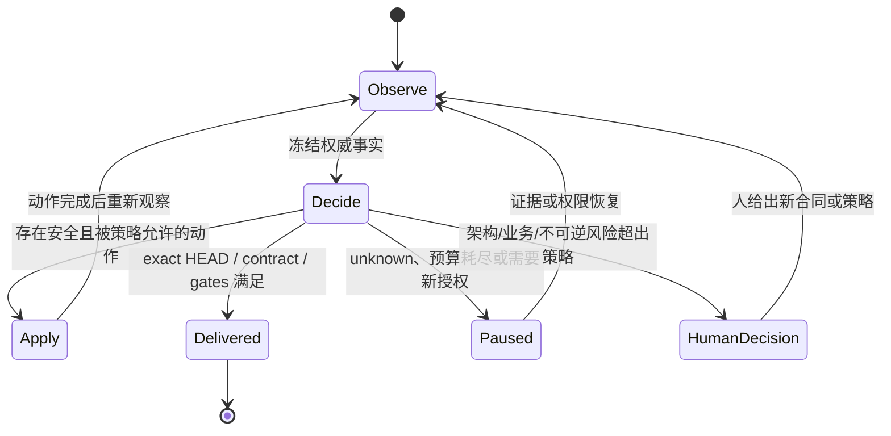
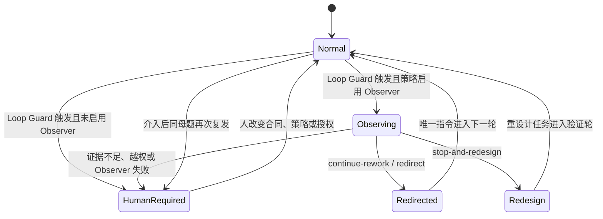

# 交付状态机

> Status: Accepted | Parent: [当前有效架构](../architecture.md)

ClickVibe 的核心不是一条预写死的脚本，而是 level-triggered reconciliation loop：

## 四个阶段

1. **Observe**：读取 Git、GitHub、任务所有权和必要的本地状态，形成不可变事实快照。
2. **Decide**：只由纯函数推导下一动作、暂停或交付；不得读写外部系统。
3. **Apply**：调用已有 use case 执行一个副作用，包括 Agent 开发、review、同步、PR 协作或 merge。
4. **Re-observe**：验证副作用实际发生，再进入下一轮。

## 正确性要求

- **Safety**：stale review、契约变化、冲突、unknown ownership、授权失败和 GitHub 门禁不得被自动跨越。
- **Conditional liveness**：条件满足且策略允许时，系统不得停下来等待无意义的人类点击。
- **Recoverability**：进程重启、重复回调和会话失效后，从当前事实恢复，不依赖易失游标。
- **Convergence**：循环只能收敛为交付完成、明确暂停或需要人类改变合同/策略。

## 冲突不是异常终点

baseline 推进造成的合并冲突属于可恢复工程工作。ClickVibe 保留冲突现场，将 exact baseline、冲突文件和目标交给 Coding Agent；解决冲突后旧 Review 自动失效，必须对新 HEAD 重新验证。只有工作区所有权不明、可能覆盖他人现场或反复无进展时才升级给人。

## 正交的循环控制状态

`developing / review-ready / reviewing / passed` 描述代码交付事实；Observer 描述控制器是否允许循环继续。两者不能合成一个 stage，否则一次观察介入会伪造代码是否完成。

Loop Guard 在 v0.3 即可直接进入带最低完整证据的 `HumanRequired`。v0.6 数据证明有效且策略启用 Runtime Observer 时才进入 `Observing`；此后当前 workflow 的普通 Coding/Review 推进必须冻结，但其他 Issue 可继续并行。Observer 结束后只能通过同一串行 workflow 命令域提交判决并恢复；迟到的 Observer 结果必须携带 generation/evidenceHash，在临界区内被拒绝，不能覆盖后继轮次。
