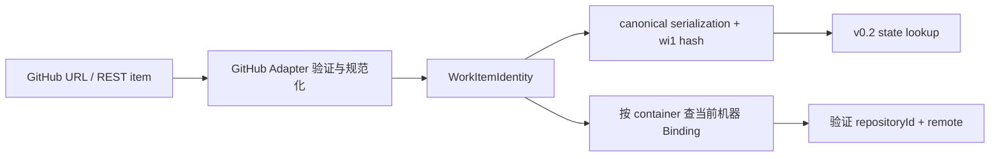

# #134 WorkItemIdentity 与 ProjectBinding L3 设计

> Status: Review candidate | Maintainer direction: clean break confirmed | Issue: [#134](https://github.com/ai-daming/clickvibe/issues/134) | Code baseline: `dc19103fa67bfbea60010038117f971f1e68d930` | Architecture baseline: `9f841f1bc93604e8d802e3776997016140840e47` | Required decision: [ADR-0009](../architecture/decisions/0009-v02-clean-break-local-state-and-config.md) | Upgrade protocol: [v0.2 本地配置与状态升级协议](../architecture/v02-upgrade-protocol.md)

## 0. 结论

#134 不只是新增四个字符串类型。它要把当前同时承担身份职责的 `repoKey`、Issue URL、workflow key 和本地 path 拆开，并建立两个唯一回答：

- “这是哪个外部 Work Item”只由 `WorkItemIdentity(provider, instance, container, id)` 回答；
- “这台机器用哪个 Git clone 执行”只由 `ProjectBinding` 回答。

本设计选择 v0.2 clean break：v0.1 state 冷备份，新的空 v0.2 state 继续使用 `~/.clickvibe/state`；旧 Git worktree/branch 原样保留但不自动导入。它推翻了已发布基线中的 legacy event 迁移要求；本地文档与 GitHub Issue #132、#134、#136、#137 已作为一组协调提案同步。PR 分支不是架构事实源；只有 exact-SHA review 通过并合入 `main` 后，这组 `Accepted` 文档才成为 Coding baseline。

## 1. 范围

### 1.1 目标

1. 落地 provider-neutral `WorkItemIdentity`，并成为领域层唯一 Work Item 身份。
2. 落地机器本地 `ProjectBinding`，明确 provider container、clone-stable `repositoryId`、当前 path 与显式 primary remote。
3. 定义 canonical serialization、hash、持久化 key 和冲突校验。
4. 定义 v0.1 → v0.2 配置/state clean-break 升级的事实源、不变量、阶段、失败和回滚。
5. 为 #122、#131、#135 和 #136 提供稳定作用域，不提前实现这些 Issue。

### 1.2 非目标

- 不实现跨机器注册、心跳、远程下单、任务迁移或执行地选择。
- 不改变 GitHub rename 语义；需要改变 `container` 稳定性时另立 superseding ADR。
- 不实现 WorkItemContractSnapshot、三个访问平面或 v0.3 EventEnvelope。
- 不自动迁移、删除、reset、stash 或 push 旧 worktree/branch。
- 不把本地 `repositoryId`、`bindingId` 或 host identity 放进 WorkItemIdentity。
- 不保留 v0.1 active runtime 的 state/config 兼容解析器；该点必须先由 ADR-0009 生效。

## 2. 现状事实与问题

当前 `IssueWorkflow` 同时持有：

```ts
interface IssueWorkflow {
  key: string
  url: string
  repoKey: string
  worktree: string
  branch: string
  // task/review/delivery/events ...
}
```

当前 `src/` 中 `repoKey` 分布在 39 个文件、262 行、共 290 次文本匹配，另有 22 行 `issueKey(...)` 调用；口径分别由 `rg -l 'repoKey' src`、`rg -n 'repoKey' src`、`rg -o 'repoKey' src` 和 `rg -n 'issueKey\(' src` 复核。`config.yaml` 使用未版本化的 `owner/repo -> localPath` 映射。当前 state path 又从 `repoKey + Issue URL number` 推导。结果是：

- URL、repoKey、workflow key 和 path 都在不同位置冒充身份；
- GitHub number 验证渗入 workflow/infra；
- 相同 remote 的不同 clone 无法形成独立本地作用域；
- path 移动会影响绑定，remote 相同又可能错误合并 clone；
- 新旧 key 并存时没有唯一冲突应答源。

Git/GitHub 仍是代码、worktree、refs、Issue、PR、Review 和 CI 的权威；ProjectBinding 只是机器本地配置，不能提升事实等级。

## 3. 已确认决策与取舍

| 决策 | 采用 | 拒绝及原因 |
|---|---|---|
| Work Item 权威 | v0.2 领域层只认 WorkItemIdentity | types-only facade 会让 repoKey 继续当第二身份源 |
| repositoryId 单位 | 一个真实 clone 一个 ID；其 worktree 共用 | remote 级 ID 会合并独立 clone；path 级 ID 会随移动漂移 |
| repositoryId 存储 | Git common-dir 的 `clickvibe/repository-id` | config-only 无法证明 path 指向原 clone；path/remote hash 不稳定或不隔离 |
| v0.1 state | 整体冷备份；新 state 仍为 `~/.clickvibe/state` | 永久兼容增加双 schema；直接删除不可恢复 |
| 多机器 | 同 container 可有多个 Binding；每台机器当前启用一个 | 当前实现 clone picker 或远程调度是无消费者设计 |
| config | 显式授权后一次性转 v0.2 schema | 永久兼容 `repos` 把 legacy 债务带回运行时 |
| primary remote | Binding 明确保存 | upstream/顺序自动猜测会把读写路由到不同 remote |
| Binding mismatch | fail-closed + explicit rebind | 自动改 config 或仓库 ID 会把错误绑定伪装为成功 |
| 升级触发 | detect → preview → authorize → apply → read-back | 启动时隐式升级越过用户授权；手工改文件易错 |
| 旧 worktree | 保留、不导入；碰撞时阻止新任务 | 自动导入无法恢复写凭证/Review basis；删除会丢真实代码 |

## 4. 权威与不变量

### 4.1 权威表

| 问题 | 唯一应答源 | 其他数据的角色 |
|---|---|---|
| 外部 Work Item 是谁 | Provider Adapter 产出的 WorkItemIdentity | URL/displayKey 是 locator/展示 |
| 本地 clone 是谁 | Git common-dir 中的 repositoryId 文件 | config 中的值是 expected pin |
| container 绑定哪个 clone | 当前机器 v0.2 config 的 ProjectBinding | localPath 是 locator，可变化 |
| primary remote 是谁 | ProjectBinding.primaryRemote | current upstream 只作观察，不自动覆盖 |
| worktree/branch/dirty/conflict | 本地 Git | state 只保存观察或关联线索 |
| Issue/PR/Review/CI | Provider（当前 GitHub） | state/cache 不能覆盖 Provider |
| v0.2 task/session/log | 新 `~/.clickvibe/state` | v0.1 冷备份不授权动作 |

### 4.2 强制不变量

1. 四元组全部是非空字符串；GitHub number 只在 GitHub Adapter 转为十进制字符串。
2. core 不从 URL 猜 provider、instance、container 或 id。
3. WorkItemIdentity 不含 host、path、remote、repositoryId、branch 或 run id。
4. 一个 Git common-dir 只有一个 repositoryId；主 checkout 与 linked worktree 必须读到同一值。
5. 不同 clone 即使 primary remote URL 相同，也不得共用 repositoryId。
6. 当前机器同一 container 最多一个 active Binding；系统层允许其他机器拥有不同 Binding。
7. config pin、common-dir repositoryId、bindingId 推导必须一致；不一致时所有 Git 写和 Provider 写 fail-closed。
8. primaryRemote 必须存在于目标 clone；不得因当前 branch upstream 改变而漂移。
9. preview 阶段零写入；authorization 只覆盖 preview 指纹绑定的精确升级计划。
10. v0.1 state 冷备份和 Git 现场不被自动删除；新 v0.2 runtime 不读取冷备份授权动作。
11. 既有 worktree/path/branch 冲突时拒绝创建或覆盖；dirty、conflicted、ahead 均保持原样。
12. unknown schema、损坏记录、缺失 identity 或部分升级不能解释成空状态或成功。
13. apply 从授权复核到 `verified`/`rolled_back` 必须持有跨进程升级锁与宿主 generation fence；单靠新版本锁不能声称阻止旧二进制。
14. journal 与 config/state 必须内容原子且 durable；路径存在不等于内容完整，rename 成功不等于父目录已经持久化。
15. 同机目标 config 中 repositoryId 必须唯一；复制 clone 产生的重复 ID 必须显式 regenerate/rebind，禁止静默认作同一 clone。

## 5. 核心契约

### 5.1 WorkItemIdentity

沿用 ADR-0006：

```ts
interface WorkItemIdentity {
  provider: string
  instance: string
  container: string
  id: string
}
```

Provider Adapter 负责 provider-specific normalization；core serializer 不自行 trim、lowercase 或解释字段。GitHub Adapter 至少保证：

- `provider = "github"`；
- `instance` 为规范化 host；
- `container` 使用 Adapter 返回的 canonical owner/repository 表达；
- `id` 为正整数的十进制字符串。

### 5.2 Canonical serialization 与 key

序列化输入固定为无空白 JSON array：

```json
["clickvibe.work-item-identity",1,"github","github.com","ai-daming/clickvibe","134"]
```

规则：

- UTF-8；
- 固定 array 顺序，不按对象键枚举；
- 四字段缺失、空串或非字符串直接拒绝；
- JSON escaping 负责换行、引号和反斜杠，不使用分隔符拼接；
- hash policy version 固定为 `sha256-v1`；它与 tuple、config 和产品版本各自独立；
- durable key 为 `wi1_<sha256 bytes 的 base64url>`。

tuple 中的 `1` 与 `wi1_`/`pb1_` 表示各自 canonical serialization schema；config `schemaVersion: 1` 只表示 config schema；`sha256-v1` 只表示 hash policy。三根版本轴数字相同不代表联动升级。

state root 使用：

```text
~/.clickvibe/state/work-items/<durable-key>/
```

根记录必须同时保存完整 WorkItemIdentity；读取时重算 key 并核对，避免 hash/path 被当作无需验证的身份。

### 5.3 Repository identity

真实位置通过以下命令获得，不得拼接字面量 `.git`：

```bash
git rev-parse --path-format=absolute --git-common-dir
```

repositoryId 文件：

```text
<git-common-dir>/clickvibe/repository-id
```

首次注册生成 `repo_<UUID>` 时，必须先在同目录 exclusive-create temp、写完整内容并 fsync，再用 hard link 竞争性发布最终路径并 fsync 父目录；不能把 `O_EXCL open` 与“内容原子”混为一谈。已存在时只读并验证完整格式，禁止覆盖；空/半写/symlink 文件 fail-closed。并发注册只能有一个发布者，其他调用读取赢家结果。路径移动不改变 ID；重新 clone 得到新的 common-dir 和新的 ID。

preview、启动和高风险动作必须检查目标 config 内 repositoryId 唯一。同一 ID 指向不同 real common-dir（典型原因是 `cp -r` clone）时，两条 Binding 都不可写，必须显式 regenerate/rebind 其中一个 clone。当前 Slice 只接受带工作树的顶层 repository；bare repository 和 submodule fail-closed。

### 5.4 ProjectBinding 与 config

运行时契约沿用 core-contracts：

```ts
interface ProjectBinding {
  schemaVersion: 1
  bindingId: string
  container: {
    provider: string
    instance: string
    id: string
  }
  repository: {
    repositoryId: string
    localPath: string
    primaryRemote: string
  }
}
```

bindingId 对以下 canonical tuple 计算 `sha256-v1`：

```json
["clickvibe.project-binding",1,"github","github.com","ai-daming/clickvibe","repo_<UUID>"]
```

config v0.2 示例（这是第一版带版本的 config schema，因此从 `1` 开始；不与产品版本号绑定）：

```yaml
schemaVersion: 1
worktreeRoot: /Users/example/.clickvibe/worktrees
fetchTtlSeconds: 45
diagnosticsMaxBytes: 10485760
projectBindings:
  - schemaVersion: 1
    bindingId: pb1_<base64url-sha256>
    container:
      provider: github
      instance: github.com
      id: ai-daming/clickvibe
    repository:
      repositoryId: repo_<UUID>
      localPath: /Users/example/work/clickvibe
      primaryRemote: origin
```

config 中的 repositoryId 是 expected pin，不是 clone 身份源。v0.1 的合法 `worktreeRoot`、`fetchTtlSeconds`、`diagnosticsMaxBytes` 在转换中保留；`worktreeRoot` 缺失时目标值固定为 `~/.clickvibe/worktrees`，也是 worktree collision guard 的唯一根路径。启动和每次高风险动作前至少验证：path 是带工作树的顶层 Git repository、common-dir ID 匹配且同机唯一、primaryRemote 存在。缺少 Binding 时 Provider 只读展示仍可用，需要 worktree/Git 的动作不可用。

## 6. 数据流

### 6.1 Provider Work Item



workflow、cache、authorization、diagnostic 和后续 access plane 只接收 identity/key，不自行解析 URL 或重造 repoKey。

### 6.2 多机器边界

同一 Work Item 在 Mac 与 Ubuntu 上得到相同四元组；两台机器各自拥有不同 repositoryId/bindingId。当前版本不引入 host registry。未来执行路由可使用 `hostId + bindingId`，但 hostId 不进入 WorkItemIdentity，也不改变本设计的 key。

## 7. v0.1 → v0.2 显式升级

[v0.2 本地配置与状态升级协议](../architecture/v02-upgrade-protocol.md)是 Slice 2 的规范性实现规格；本节只保留决策摘要，避免历史 plan 与当前架构各自维护一套恢复规则。

全新安装没有 legacy config/state 时不进入 legacy 状态机，但创建 Binding、repositoryId、schema 1 config 和空 state 仍走 preview/authorization。检测到未版本化 config、v0.1 state 或未完成/损坏 journal 时，普通写操作全部阻断。

升级不是“先检查再搬目录”：apply 必须先取得跨进程升级锁和宿主 generation fence，在临界区重新确认旧进程不能启动并重算 fingerprint。单靠 v0.2 新锁无法约束旧二进制；无法停用旧入口的环境必须退出宿主并使用离线升级。

所有易失败准备先完成：durable journal、精确 config backup、内容原子的 repositoryId、可完整解析的 staged config、带 marker 的 staged state。只有准备全部回读通过，才允许把旧 state rename 到 cold backup、激活 staged state、原子替换 config。每次 journal/config/marker 写入都使用同目录 temp + file fsync + rename/link + parent-directory fsync。

状态机显式包含 facts changed 后 `authorized → previewed`、prepare/cutover 失败后的 recovery preview、以及经新授权的 resume/rollback。未完成 journal 优先于全新 preview；journal torn/corrupt/missing/unknown 或 config/state 混合代次都只能进入只读 recovery inventory，不能解释成空项目。

无效 repos 条目必须逐条修复或显式 exclude，选择与原因进入 fingerprint；旧 config backup 保留完整原值。固定备份路径为 `config-v0.1-backup-<timestamp>-<nonce>.yaml` 与 `state-v0.1-backup-<timestamp>-<nonce>`，均不自动删除。

## 8. 旧 worktree 与新任务

v0.2 启动时从 Git 实时读取 worktree/branch，而不是从 cold state 推断。若目标 Issue 的默认 worktree path、branch 或 Git branch 已存在：

- 展示实际 path、branch、HEAD 和 dirty/conflict/ahead 状态；
- 禁止覆盖、reset、stash、删除、自动 push 或自动关联为当前 workflow；
- 返回 `existing-unmanaged-worktree`（命名可在实现中确定）的明确阻断；
- “采用”旧现场属于新的显式动作，必须重新观察 Issue/PR/HEAD、建立新 v0.2 workflow，并让旧 Review/授权失效。本 Issue 不实现采用动作。

## 9. 安全与运维要求

- `config.yaml` 和 upgrade journal 权限不得放宽；repositoryId 不是 secret，但仍禁止通过不受控 symlink 写出 common-dir。
- 所有路径来自 Git/config 验证结果，不拼接未验证 shell 字符串。
- primaryRemote 是显式名字；写动作仍需各自授权和远端回读，Binding 验证不授予 push/merge 权限。
- 原始升级错误写入 journal/diagnostic；分类不能覆盖错误文本、动作和目标。
- 普通启动检测到旧 schema、未完成 journal 或 Binding mismatch 时必须可解释地拒绝写，而不是显示为空项目。

## 10. TDD 与验证矩阵

### 10.1 纯逻辑 RED

- WorkItemIdentity 四字段缺失、空串、非字符串拒绝。
- GitHub Adapter 的数字边界与 provider-neutral core 分离。
- canonical JSON 对引号、反斜杠、换行和字段边界无碰撞。
- 相同 identity 得到相同 `wi1` key；任一字段变化 key 变化。
- bindingId 对 path/primaryRemote 变化保持稳定，对 repositoryId/container 变化失效。
- config pin/common-dir ID/remote 校验返回明确 unknown/error，不返回 false success。

### 10.2 真实 Git 集成 RED

使用临时 HOME 和真实 Git repository，不引入 mock library：

- 主 checkout 与 linked worktree 读取同一 repositoryId；
- 两个相同 remote 的独立 clone 得到不同 ID；
- `cp -r` 复制出的重复 repositoryId 在目标 config 校验时 fail-closed，显式 regenerate 后恢复唯一；
- repository 目录移动后 ID 不变；
- 并发首次注册只产生一个完整 ID；temp write/fsync/link 各窗口失败不能留下空/半写最终文件；
- 已存在无效/不一致/symlink ID fail-closed；bare repository 与 submodule 不注册；
- 显式 primaryRemote 缺失时 Binding 不可写；
- dirty/conflicted/ahead worktree 在 preview/apply 后字节、HEAD、refs 不变。

### 10.3 升级集成 RED

- preview 对 config、state、common-dir、worktree 零写入；
- plan fingerprint 绑定全部目标，任一事实变化使授权失效；
- 两个 upgrader 只能有一个锁赢家；旧 v0.1 job 在 generation fence 内无法启动；
- 成功升级生成 config backup、cold state backup、新同路径 state 和 verified journal；
- 每次 file fsync、rename、directory fsync 和 journal replace 前后注入真实文件系统失败，证明可 resume 或 rollback；
- journal torn/corrupt/missing/unknown 与 config/state 混合代次只进入 recovery inventory；
- 旧 state 初始缺失与 cutover 后缺失可由 durable journal 明确区分；
- v0.1 `worktreeRoot`、`fetchTtlSeconds`、`diagnosticsMaxBytes` 保留/默认/非法输入与 dead repo 逐条 exclude 均有转换测试；
- 旧 config/state 不被 v0.2 active runtime 兼容读取；
- 未完成 journal、未知 schema、live task、ID mismatch 均阻止写；
- 备份目标重名不覆盖；cold backup 永不自动删除；
- 既有 worktree/branch 不被导入或清理，新任务碰撞时明确拒绝。

### 10.4 工程门禁

实现 PR 必须通过：

```bash
pnpm run typecheck
pnpm run build
pnpm test
pnpm run coverage
pnpm run lint
pnpm run check:size
pnpm run check:layers
pnpm run check:state-writes
```

覆盖率保持 statements/lines/branches/functions 全部满足仓库阈值；Review 绑定实现 PR exact head 与本设计合入后的 baseline SHA。

## 11. 实施切片与门禁

### Slice 0：架构生效（本设计 PR）

- 审查 ADR-0009；
- 若接受，同步 roadmap、canonical-domain-model、core-contracts、observability、#136 和 #137；
- 更新 #134 的架构影响等级、baseline SHA、约束和验收；
- 合入后记录 exact architecture baseline SHA。

### Slice 1：纯身份与 Binding 契约

- 先写 canonicalization/hash/config validation RED；
- 最小实现 WorkItemIdentity、repositoryId、ProjectBinding 纯契约与 infra adapter；
- 不混入三个访问平面。

### Slice 2：显式升级器与 state cutover

- 先按[规范升级协议](../architecture/v02-upgrade-protocol.md)写锁/generation fence、preview/apply/recovery 和真实 Git/文件系统 RED；
- 实现 durable journal、内容原子 repositoryId、精确备份、完整 config 转换、staged state、cutover 和 read-back；
- 遵守本设计 PR 已同步的 `AGENTS.md` state 格式红线；只有 Accepted ADR + 显式升级协议可以授权代次切换；
- 保留 worktree collision guard，不实现旧现场采用。

Slice 1/2 是否拆为两个实现 PR，由设计 PR Review 根据实际 diff 与迁移原子边界决定；不得把设计变更和功能实现放进同一 PR。

## 12. 完成标准

本文可从 Draft 进入 implementation-ready 的前提是：

1. ADR-0009 被明确 Accepted，且所有 Required Baseline Changes 同步合入；或维护者撤回 clean-break 决策，本文按 ADR-0006 重写迁移部分。
2. #134 body 明确 L3、Accepted baseline SHA、事实源、不变量、迁移和回滚入口。
3. Review 证明 WorkItemIdentity/ProjectBinding 没有泄漏 GitHub 专属响应类型或 host identity。
4. 升级协议对每个写目标有 preview、authorization、journal、read-back 和恢复路径。
5. 旧 worktree/branch 的保留边界与碰撞阻断有真实 Git 测试。

在以上条件满足前，#134 仍是设计阶段，不得开始 Coding。
