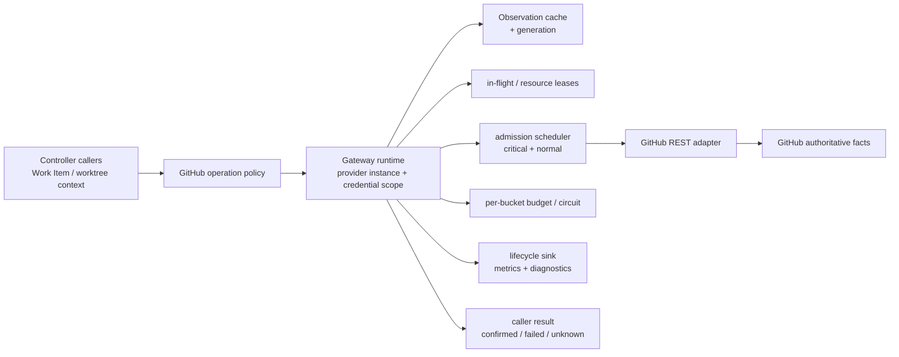

# Issue #131 GitHub REST Gateway 完整设计

> Status: Design baseline candidate | Issue: [#131](https://github.com/ai-daming/clickvibe/issues/131) | Coding baseline: `b580c31658f3c50616493c029afb57065a22dbcd` | Decision: [ADR-0010](../architecture/decisions/0010-github-rest-gateway-admission-and-lifecycle.md)

## 1. 为什么现在是设计轮

#131 在第一次 Coding 前已经有目标、约束、计量口径和验收标准，但没有回答 Gateway 的算法、状态所有者、原子边界与关闭生命周期。PR #149 因而在实现中逐步发明计数器、证据记录和 diagnostics 关闭语义；Review 只能针对当前形状逐个构造反例。这些反例是真问题，但不是需求来源。

本设计从 Issue #131、ADR-0002/0007、#133 冻结基线和维护者确认的决策独立推导。PR #149 当前 head 只作为“未受前置设计约束的实现样本”冻结，不为本设计背书，也不默认保留。

设计准则是：**程序 = 算法 + 数据结构**。数据结构必须被算法读写，算法的每个状态必须有唯一所有者；只被存在性测试读取的结构不进入实现。

## 2. 目标、边界与非目标

### 目标

- 所有 Controller-owned GitHub REST 读取与写入经唯一 Gateway 申请、执行和结算。
- 同一凭证下跨 Work Item/worktree 合并安全读取、控制并发和 rate-limit，不让一个慢仓库占满执行容量。
- 普通读取可复用 Observation；关键门禁在本次申请后获得 GitHub 确认。
- 写操作只有在失效并权威回读匹配后才 confirmed；其余明确 failed 或 unknown。
- #133 计量从真实请求生命周期派生，并由阈值报告和 diagnostics 消费。

### 非目标

- 不治理 Agent-owned 直接 `gh`；只在关键副作用后由 Controller 重读。
- 不把 Local Git、Remote Git 和 GitHub API 放进万能队列；`git fetch` 属于 #135。
- 不建立跨进程 daemon、持久任务队列、持久 REST cache 或 exactly-once 写协议。
- 不引入 UI、auto-run 流水线并发上限、第二 provider SDK 或 v0.3 完整 EventEnvelope。
- 不用本设计解释或修补 PR #149 的每一轮 finding；实现必须重新由不变量推导。

## 3. 不变量

1. GitHub 是 Issue/PR/Review/CI 事实源；Gateway 只拥有访问过程和 Observation。
2. `providerInstance + credentialScopeId` 在一个 Controller 进程内只有一个 Gateway owner。
3. worktree/Work Item 标识调用归属，不进入 GitHub 资源事实 key；不同凭证绝不共享缓存、预算或 join。
4. 每个 logical request 恰有一个 terminal；成功读取只属于 cache hit、join 或 execution 之一，非成功属于 logical failure/unknown。
5. 每个真实 HTTP page/retry 恰记一个 upstream execution；logical request 数不能由 subprocess 数代替。
6. 只有 operation policy 决定最低一致性、joinability、重试和写后 readback；调用者只能收紧，不能放松。
7. generation 不匹配的缓存不可应答；失效后旧 in-flight 结果可以返回给旧调用者，但不得重新填充当前 cache。
8. 非幂等写最多派发一次；没有匹配的权威回读不得 confirmed。
9. primary/secondary limit 是准入条件，不是排序权重；critical 不能越过限流。
10. `close()` 后不接受新申请；关闭前已登记的每个请求必须 terminal，然后 evidence writer 才能 flush/close。
11. diagnostics 写入失败不能被当作业务成功或失败；高风险业务结果必须进入 workflow 正式状态。
12. Controller 绕过 Gateway 的调用路径必须可静态枚举，并最终由机器门禁归零。
13. 非幂等写在派发前必须留下持久 attempt marker；重启恢复只允许 readback，不能恢复 write dispatch。

## 4. 所有权与系统结构



Gateway owner 存在于 ClickVibe Controller 进程，而不是某个 `ctx`、worktree 或 route。`credentialScopeId` 由 GitHub adapter 从宿主认证上下文生成不透明 identity，不含 token，也不由业务调用者填写；无法安全区分时保守合并为一个 scope。credential 变化生成新 owner generation；旧 owner 进入 close。跨进程共享同一 token 是显式盲区，不得把单进程指标宣称为外部凭证全量。

## 5. 请求声明与中央 operation policy

以下是语义草图，不要求实现时逐个建立同名公开类型：

```ts
interface GithubAccessIntent<TInput> {
  requestId: string
  context: {
    workItem: WorkItemIdentity | null
    worktreeId: string | null
    correlationId: string
  }
  operation: GithubOperationId
  subject: GithubResourceKey
  priority: 'critical' | 'normal'
  consistency: 'cache-ok' | 'upstream-confirmed'
  cost: { kind: 'one-request' } | { kind: 'bounded-pages'; maxPages: number } | { kind: 'unknown' }
  deadlineAt: number
  input: TInput
}

interface GithubOperationPolicy<TInput, TValue> {
  effect: 'read' | 'write'
  allowedPriorities: Array<'critical' | 'normal'>
  minimumConsistency: 'cache-ok' | 'upstream-confirmed'
  joinable: boolean
  plan(input: TInput): GithubHttpStep<TValue>
  affectedResources(input: TInput): GithubResourceKey[]
  readback?: {
    plan(input: TInput): GithubHttpStep<unknown>
    confirms(input: TInput, observation: Observation<unknown>): boolean
  }
}
```

调用者声明它知道的用途、deadline 和成本上界；operation policy 校验并补足安全语义。`critical` 只给 merge/Review/exact HEAD/契约门禁及写后回读；普通面板刷新为 normal，调用者不能把任意后台读取升级成 critical。任何 operation 都不能靠传参把 policy 降级。若实际分页需要超过调用者声明的 `maxPages`，下一页不得派发，logical request 以明确的 cost-bound failure 结束。

资源 key 至少包含 provider instance、credential scope、repository、resource kind/id、subresource 和影响响应的规范化 query/accept。请求来源 worktree 不进入 key，所以相同 GitHub 事实可跨 worktree join；本地 HEAD/dirty 根本不进入本 Gateway。

## 6. 消费算法

### 6.1 主状态机

```text
declare + validate
  → cache lookup (read/cache-ok only)
  → compatible in-flight join (safe read only)
  → rate/deadline/resource admission
  → priority lane + repository round-robin
  → dispatch one HTTP step (non-preemptive)
  → settle actual response/budget/evidence
  → complete | enqueue next page | write invalidation/readback
```

伪代码：

```text
submit(intent):
  reject if owner closing or policy invalid
  emit declared
  if eligible cache observation exists: terminal(hit)
  else if compatible leader exists: attach follower; maybe promote queued leader
  else enqueue planned step

dispatch():
  while credential slot available:
    candidate = next eligible critical, else aged/normal by repository round-robin
    require deadline, bucket, pacing and resource lease eligibility
    dispatch one step; do not hold scheduler lock while awaiting network

settle(step, response):
  emit one upstream settlement and update actual bucket evidence
  if next page exists: re-enqueue continuation
  else publish complete Observation or enter write readback
```

### 6.2 公平性与分页

每个 credential owner 有总并发上限，每个 repository 有更小上限。critical lane 先选；normal 等待达到冻结 aging 条件后获得执行机会。同 lane 内按 repository 轮转、repo 内 FIFO。慢 HTTP 只占自己的 slot，不持有调度器互斥。

分页的调度单位是一个 HTTP page。完整 logical request 只有在全部页成功后产生可缓存 Observation；中间页不对调用者发布，也不写成完整 cache。每页结算后 continuation 重新参与优先级、deadline 和预算准入，使后到的关键门禁可以插入。

## 7. Cache、singleflight 与 generation

Cache 复用 `CacheEntry<T>` 契约；进程内 slot 额外关联当前 resource generation。`cache-ok` 只有在 TTL 与 generation 都有效时命中。`upstream-confirmed` 必须派发条件或普通请求；`304` 只在 validator、generation 和旧 Observation 同时匹配时确认旧值仍当前。

Merge key 包含 owner、resource、operation、规范化参数和所需一致性。`cache-ok` follower 可以加入已满足更强一致性的 leader；反向不允许。高优先级 follower 可提升尚未派发的 leader，不能抢占已运行 step。follower 取消只移除自己；leader 已派发后不会因 follower 数为零而伪装成未执行。

失效在 owner 的串行状态更新中递增受影响 resource generation、删除 cache，并阻止旧 generation 的迟到 leader 回填。失效不是“删 map 即完成”；只有后续权威 Observation 或 write readback 才能证明重新观察。

## 8. Rate-limit 准入

预算按 GitHub 响应的真实 resource bucket 记录 `limit/remaining/used/reset/observedAt`；缺失字段保持 unknown，不回退到 core。`used` 是该响应的 bucket snapshot，不自动冒充本次请求消耗；只有隔离凭证或可证明的前后 delta 才能发布硬消费值，共享凭证样本标 contaminated。secondary limit/`Retry-After` 作为 credential 级暂停，primary exhaustion 按 bucket 暂停。

owner 重启或 bucket unknown 时，只允许保守数量的 unknown-budget step 同时执行；响应后立即结算。若仍无头，保持保守模式而非记零。已知 remaining 不足时，reset 早于 deadline 才排队，否则返回 `rate-limited { retryAt }`。分页每页重新准入。

写 operation 在预算已知时为写 step 与强制 readback 共同准入。预算 unknown 不冒充可预留：可以保守执行一次写，但若后续 readback 被限流，结果只能 unknown。critical 不绕过 primary、secondary 或 caller deadline。

## 9. 写、失效与权威回读

```text
acquire affected-resource lease set atomically
  → persist write-attempt marker
  → policy-required upstream precondition
  → dispatch exactly one write attempt
  → increment affected generations and evict cache
  → dispatch exactly one upstream-confirmed readback
  → compare operation-specific predicate
  → confirmed | failed | unknown
  → release leases
```

多个资源 lease 必须由 owner 一次性按规范化 key 排序取得，禁止逐个取得造成死锁。持 lease 期间，涉及这些资源的普通读取排队；无关资源继续执行。

attempt marker 由调用方 workflow/action 状态持久化，至少包含 request id、operation、目标、预期谓词与“write 尚未确认”。marker 成功落盘前不得派发写。它不是可恢复队列：进程重启看到 marker 时，只能执行 readback 并结算 confirmed/unknown，绝不能再次派发 write。

明确 4xx/校验拒绝且能证明写未发生时为 failed。成功响应不能单独 confirmed；传输中断也不能自动 failed，因为 GitHub 可能已经执行。两者都经过失效和一次 readback：预期事实存在则 confirmed，无法读取或不匹配则 unknown。non-repeatable write 永不自动重放。

## 10. 生命周期证据、计量与关闭

Gateway 产生一个最小判别式生命周期流，而不是 counters、failureRecords 和 invalidationRecords 三套平行事实：

```text
declared
  → cache-hit | joined | queued
  → dispatched
  → upstream-settled
  → invalidated / readback-settled
  → terminal(succeeded | failed | unknown | interrupted | rate-limited)
```

每个调用者有自己的 declared/terminal；leader 的 upstream-settled 由 follower 通过 causation 关联。指标消费者按事件派生：`logical = successful hit + successful join + successful execution + logical non-success`，其中 failed/unknown/interrupted/rate-limited 均属于 non-success；join transition 总数另报，不拿失败 follower 填成功恒等式。每个 dispatched page/retry 是 upstream request；queued→dispatched 是 wait；每个响应产生自己的 rate observation。失败同时映射为 `DiagnosticRecord`，原始响应进入脱敏 ArtifactRef。

evidence writer 是 owner 的组成部分。`close()` 顺序固定：关闭准入 → 将未派发请求 terminal 为 interrupted → 等待已派发 step 到 shutdown deadline → 未决写标 unknown → 追加终态 → flush writer → 释放 owner。request/owner generation 对 terminal 和 cache publish 做 fencing；shutdown deadline 后才返回的响应只能记 late diagnostic，不能二次 terminal 或改写 workflow。测试和临时目录只等待 owner close，不枚举文件路径猜测后台队列。进程崩溃允许丢失末尾普通 diagnostics；write attempt 与 workflow 的 confirmed/unknown 业务状态必须独立原子持久化。

## 11. Controller 迁移与机器边界

静态基线显示读取已大多流经 `GithubRestReader`，但 API 仍以 path/loader/force 由调用者拼装，且存在 PR create、依赖 comment/PATCH、delivery comment、meta edit、approval、merge、issue close 等写 family。完整迁移按行为 family 盘点，不用“六个字符串”代替操作枚举。

基线 `b580c31` 的绕过/消费路径一次性枚举如下；实现 review 必须更新本表而不是等待 reviewer 逐轮发现：

| 基线路径 | 当前能力/风险 | 目标构造 | Slice |
|---|---|---|---:|
| `src/github/rest.ts` | raw path、250ms lane、ctx cache/in-flight | 仅 adapter 可执行 HTTP；owner 是唯一 dispatch 点 | A |
| `src/github/reads.ts` | resource loader + caller force | typed detail/reviews operation；policy 定一致性 | A |
| `src/github/facts.ts` | PR/repo aggregate cache 组合 | typed resource/aggregate plan；paged continuation | A |
| `src/github/issue.ts`、`dependencies.ts` | caller 拼 comments/timeline/dependency pages | typed read families；同资源 merge key | A |
| `src/workflow/*` gate readers | 各调用点传 `force` | gate operation 强制 upstream-confirmed | A |
| `src/workflow/repository-issues.ts` | aggregate 结果将子资源 `updated_at` 直接写入 reader versions | aggregate settlement 在 owner 内更新子资源版本元数据，cache lookup 消费；调用方不写 cache 状态 | A |
| `src/workflow/handlers.ts` | `/state` 在面板刷新前直接探测 reader circuit | panel 的 cache-ok operations 分别由 owner 准入并返回 typed `rate-limited/retryAt`；不读取 legacy circuit | A |
| `src/workflow/auto-run.ts` | action 失败后再次探测 reader circuit 归类失败 | action 直接传播 Gateway terminal `rate-limited/retryAt`；controller 不从旁路 circuit 重推原因 | A |
| `src/github/pr.ts` | PR lookup + REST create | write attempt + PR-by-head readback | B |
| `src/workflow/repository-state.ts` | comment/PATCH 后调用方 invalidate | typed writes；issue/comment predicate | B |
| `src/workflow/delivery-publish.ts` | direct `gh issue comment` | non-repeatable comment + marker/readback | B |
| `src/workflow/dev-delivery.ts` | direct comment PATCH | typed edit + comment readback | B |
| `src/github/review-approval.ts` | direct `gh pr review` | typed approval + reviews readback | B |
| `src/workflow/merge.ts` | direct merge/close + caller invalidate | exclusive merge/close predicates | B |
| `src/agent/prompts.ts` | Agent 被明确授予 `gh` | 标记 Agent-owned；只做事后 Controller observation | 排除 |

| Family | Slice A | Slice B | 最终机制 |
|---|---:|---:|---|
| Issue/PR detail、reviews、comments、timeline | 迁移 | — | typed read + resource cache/join |
| Repository issues/pulls aggregate 与分页 | 迁移 | — | typed paged read + aggregate Observation |
| merge/Review/exact HEAD/contract gate reads | 迁移 | — | policy-forced upstream-confirmed |
| Panel state/list refresh | 迁移 | — | cache-ok reads；每个 operation 独立返回 typed rate-limited terminal |
| Auto-run action 失败归类 | 迁移 | — | 消费 operation terminal；禁止失败后旁路探测 circuit |
| PR create、dependency ledger writes | allowlist | 迁移 | typed write + affected resources + readback |
| delivery/meta comments、approval | allowlist | 迁移 | typed non-repeatable write + readback |
| merge、issue close | allowlist | 迁移 | exclusive write transaction + predicate |
| Agent prompt/direct tools | 排除并标记 | 排除并标记 | Controller post-action observation only |

新增 `check:github-access` 门禁，以符号/AST 与明确 allowlist 为准，不仅文本 grep。Slice A 只能减少 allowlist 或保持；Slice B 删除所有 Controller 例外。Gateway adapter 和 Agent prompt 是不同边界，不能用一个 shell 拦截器混在一起。

## 12. 实施切片、回滚与概念预算

### Design PR（本 PR）

只提交 ADR、完整设计和 Issue/AC 映射，不修改生产代码。合入 SHA 才是新 architecture baseline。

### Slice A：读取与 Gateway 机制

按 commit/TDD 顺序：类型化读取等价提取 → owner/operation policy → 调度/预算/cache/singleflight 吸收旧 250ms lane 与 reader caches → lifecycle consumer 与 #133 阈值证据 → 静态门禁及临时写 allowlist。旧行为基准保留到迁移关闭；不得先造 consumerless 计量容器。

### Slice B：写入与确认

逐 family 迁移 typed write、resource lease、generation invalidation、readback predicate 和 workflow confirmed/unknown；删除直写 allowlist；复测 Review 密集与 Key GitHub write。没有授权测试仓库时，live 写时延保持 unknown，不补零。

回滚可以关闭普通 cache 与 join，让读取仍经 owner 直接执行；不能恢复 Controller 直写、取消关键门禁上游确认或跳过写后回读。若 Slice A 不能独立满足读取阈值，应回退该 slice，而不是让两套机制长期并存。

| 新概念 | 生产消费者 | 删除后的行为差异 |
|---|---|---|
| Credential scope identity | owner registry、预算/cache/join 隔离 | 同一预算被错误拆分或不同权限错误复用 |
| Gateway owner | 全部 Controller GitHub operations | 跨 worktree 预算/队列再次分裂 |
| Operation policy | planner、validator、read/write result | 调用方可自行降低安全语义 |
| Resource generation | cache lookup/publish、invalidation | 迟到 leader 可回填失效 cache |
| Resource lease | write planner、读写准入 | 写入与同资源读取可交错 |
| Durable write-attempt marker | workflow recovery、write dispatcher | 重启后无法区分“未写”与“可能已写” |
| Lifecycle stream | threshold reporter、Diagnostic mapper、close | 指标与失败重新成为平行旁路 |
| Owner-scoped evidence writer | lifecycle persistence、graceful close | teardown 重新猜测全局后台写入 |
| GitHub-access gate | CI migration closure | 新 direct `gh` 可静默绕过 Gateway |

不为第二 provider、跨进程恢复、动态任意权重或 UI 预建抽象。

## 13. 验收与对抗验证

### 静态枚举

- 枚举 `githubRest` factory 与全部 reader 状态/执行方法调用；基线至少包含 `json/paginate/mutate/cachedResource/cachedAggregate/invalidate/rememberVersion/resourceVersion/rateLimitError`，并枚举所有 Controller `gh api/issue/pr` 构造。机器门禁按导出符号/方法能力识别，不以这组名字作为封闭白名单。
- 每条路径登记 operation family、owner、consistency、effect、affected resources、readback 和 slice。
- Slice A 后只有具名写 allowlist；Slice B 后 Controller 绕过为零。

### 决定性交错

- 两个 worktree 同资源 join，第三个无关 direct resource 不漏计。
- normal leader 排队后由 critical follower 提升；运行中不抢占。
- 一个仓库 page 卡住时，另一个仓库 critical read 可使用保留容量。
- 分页第一页结算后让出，后到 gate read 先于第二页。
- invalidation 后旧 leader 迟到，不得回填新 generation。
- follower 取消、leader 失败、credential generation 切换和 close 与 submit 竞争均只有一个 terminal。
- shutdown deadline 后迟到响应不能二次 terminal、回填 cache 或覆盖 workflow。
- write attempt marker 落盘失败时零写派发；重启恢复 marker 时只 readback、零 write replay。
- 写响应丢失、readback 匹配/不匹配/限流分别得到 confirmed/unknown，写尝试恒为一次。
- primary bucket 隔离、secondary credential 暂停、partial/missing headers 保持 unknown。

### #133 场景与工程门禁

- Panel hot poll、五 Work Item 同仓库刷新、Review dense preflight、Key GitHub write、rate-limit 场景按冻结脚本与 implementation SHA 保存原始证据。
- 断言 queue wait 与 service time 分离；Controller 与 Agent-owned 流量分开报告。
- typecheck、build、test、coverage ≥85%、lint、size/layer/state/local-git-write、GitHub-access gate 全绿。

## 14. Issue #131 AC 映射

| Issue AC | 设计关闭点 | 实现证据 |
|---|---|---|
| Controller 经 Gateway；Agent 排除 | §2、§4、§11 | 静态枚举 + CI gate |
| read cache/join/priority/rate；隔离慢请求 | §6–§8 | 交错测试 + panel/multi/review 场景 |
| write 失效并回读 | §9 | 每 family predicate + Key write fixture/readback |
| 关键门禁不依赖 TTL | §5、§7 | policy 测试 + exact-head/merge/review 回归 |
| raw error、Retry-After、失效/readback 证据 | §8–§10 | lifecycle/Diagnostic/Artifact readback |
| logical/upstream/join/hit/wait/failure/rate 达标 | §10、§13 | 单一 reporter + #133 原始证据 |
| 多 Work Item、Review 密集、写动作零误停 | §13 | 决定性交错 + 冻结场景 |
| 工程门禁全绿 | §13 | CI exact implementation SHA |

## 15. 被拒绝的替代方案

- 用现有 reader 外包一层 scheduler：两个执行/计量应答源。
- 全局 Git/gh 权重队列：成本域、事实域和故障域错误合并。
- 调用者传任意整数权重：无法同时表达成本、优先级、join 和副作用。
- 每个 worktree 一个 GitHub cache：同凭证预算分裂、同事实重复请求。
- 所有状态持久化并重启恢复：把访问协调器升级成非幂等分布式任务系统。
- 每条 lifecycle 同步落盘：普通读取被磁盘延迟绑定。
- best-effort writer 无 owner close：证据生命周期再次外泄给 teardown。
- shell 全局拦截：误伤 Agent-owned 调用且无法理解复合命令。
